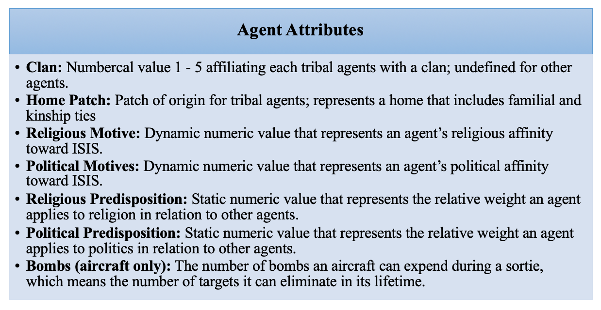
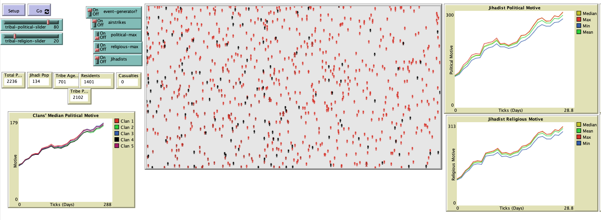

# Coalition Airstrikes in Iraq: An Agent-based Model to Test the Tribal-Islamic State Relationship

## Model Description

"Can U.S.-led airstrikes degrade the Islamic State’s standing with supportive tribes in the Anbar province? This model focuses on politically sympathetic tribes in Iraq’s Anbar province. It seeks to simulate the events of December 2013 to December 2014 and beyond in order to assess the effectiveness of airtsrikes."

## &nbsp;

The NetLogo Graphical User Interface of the Model: 

## &nbsp;

**Version of NetLogo**: NetLogo 6.1.0

**Semester Created**: Fall 2014

