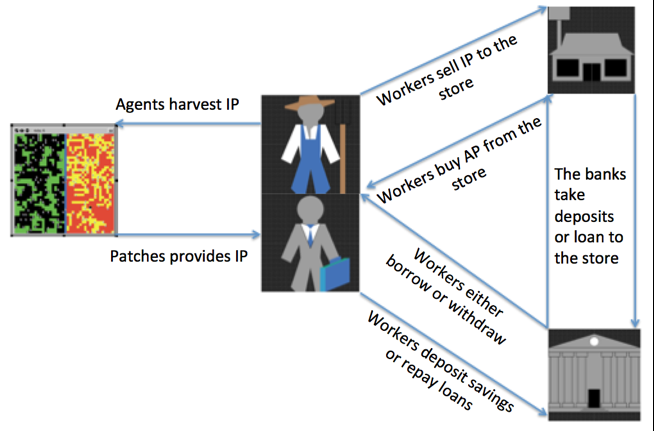
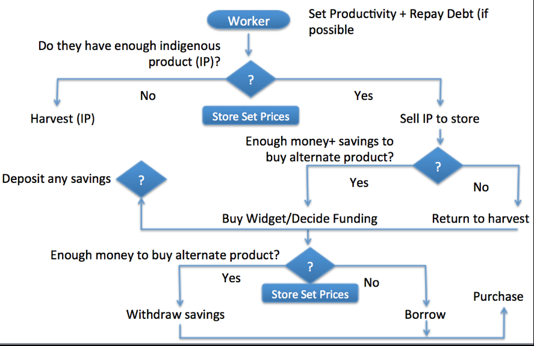
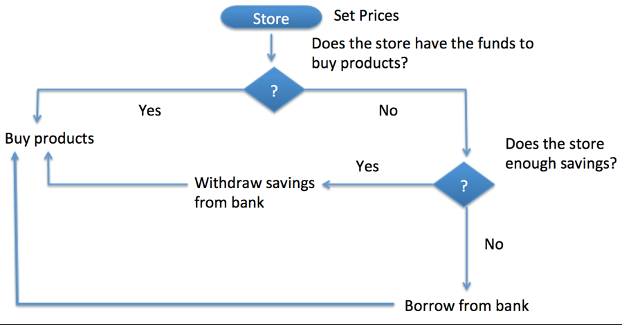
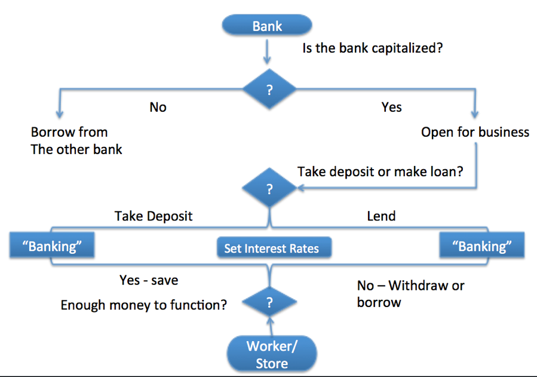

# Creating an Agent Based Artificial Economy

## Description 
"We endeavored to create an artificial economy based on simple rules that govern human behavior, but which yield states that are comparable to a real economy."

## &nbsp;
Flows Within the Artificial Economy

The Workers’ Processes:

The Stores Processes:

The Bank Processes

The NetLogo Graphical User Interface of the Model: 

## &nbsp;

**Version of NetLogo**: NetLogo 6.1.0

**Semester Created**: Fall 2014

