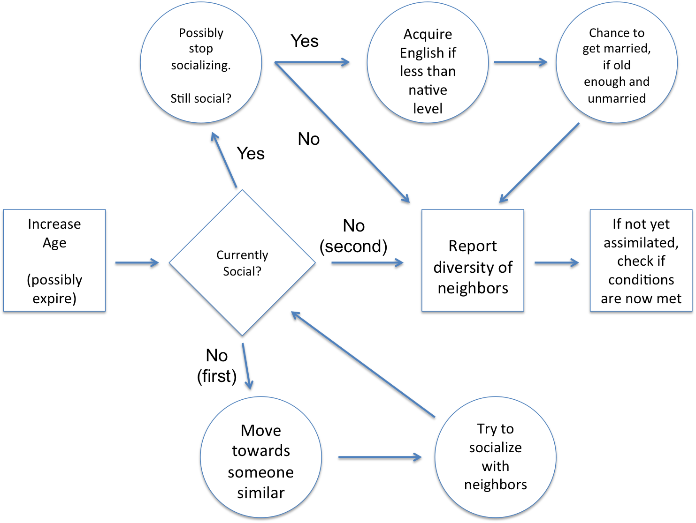
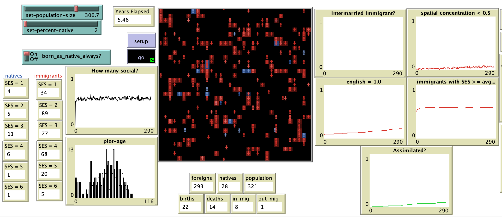

# Modeling Two-Party Assimilation with U.S. American Data

## Abstract 

"As we move deeper into the 21st century, American social science researchers continue to seek accurate measures of immigrant assimilation throughout the country. Because there is a large range of geographic locations where immigrants may be found and the perceptions of native-born vary greatly, the real difficulty is in creating a measure that appropriately accounts for uniform experiences within specific immigrant groups. The most commonly agreed upon measures take into account one or more concepts from socioeconomic status, English ability or use, the diversity of residential settlement patterns, and intermarriage rates. The present study uses an abstracted agent-based model to learn more about the processes of social interaction between immigrant groups and the native group when all four of these common measures are considered. It draws from United States statistics provided by official national data and population surveys to attempt to maintain a connection with trends in reality, although this model is not intended to be predictive and the results are considered for their general trends rather than estimates for actual rates of assimilation. By creating a set of interaction rules that allow agents some autonomy and randomly assigned life-chances, we find that the model succeeds in representing general trends that correspond with the United States, including the prevalence of English ability among those who successfully assimilate and low intermarriage rates between groups. Additionally, we find that increasing the initial population or the initial proportion of immigrants correlates with higher assimilation rates."

## &nbsp;
Flow Chart Depicting Each Agent’s Behavioral Process At Each Tick

The NetLogo Graphical User Interface of the Model: 

## &nbsp;

**Version of NetLogo**: NetLogo 6.1.0

**Semester Created**: Fall 2013

