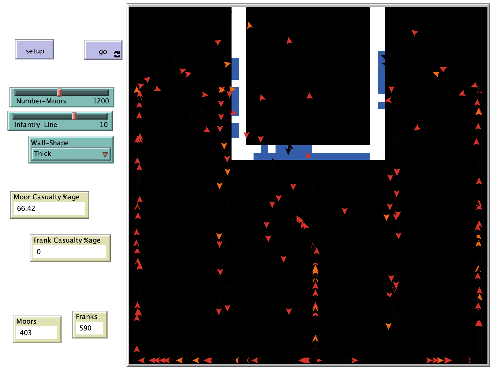

# The Battle of Tours: An Agent-Based Model

## Abstract
"The monopoly of infantry and cavalry over the battlefield was only broken after the development of gunpowder and the rise of artillery on the field of battle.  Prior to that, contests between armies usually came down to whose cavalry was more effective.  This is because, unless there was advantageous terrain, infantry were usually vulnerable to cavalry.  Indeed, the occasions of infantry triumphing over cavalry in a major battle are so rare as to be noteworthy. A computer model is developed to simulate the first part of the Battle of Tours (the part of the battle up until the Frankish force attacked the Moors’ encampment).  The model created is an agent-based model; that is, the simulated Moors and Franks follow certain rules, and can interact with each other."

## &nbsp;
The NetLogo Graphical User Interface of the Model: 

## &nbsp;

**Version of NetLogo**: NetLogo 6.1.0

**Semester Created**: Fall 2014

