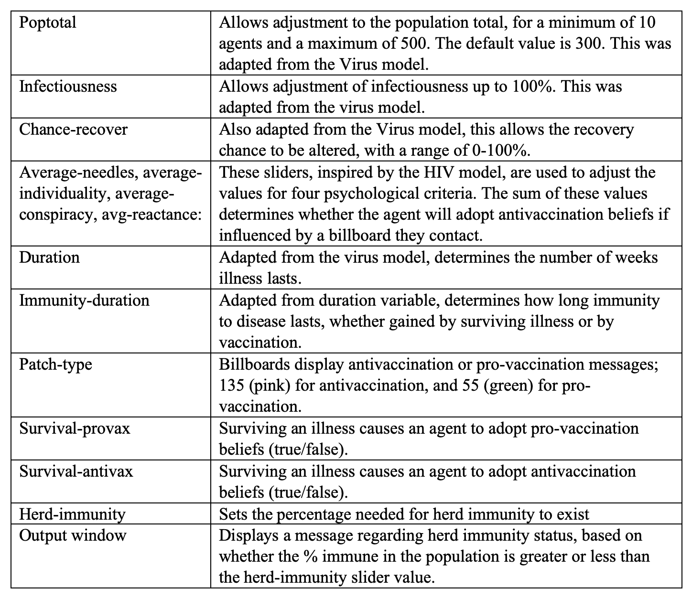
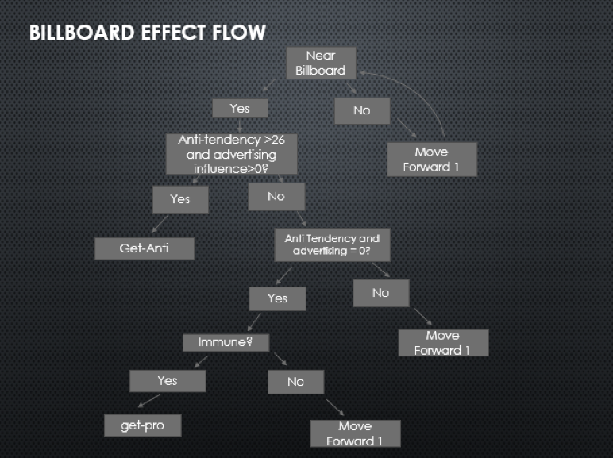
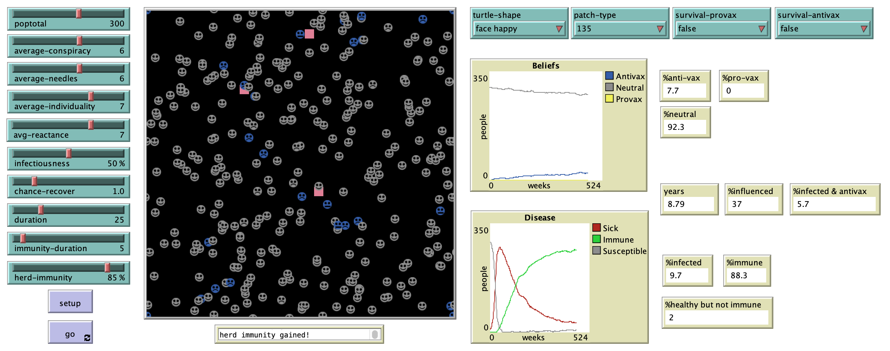

# Billboard Effects on Vaccination and Contagion (BEVAC): An Agent-Based Model.

## Abstract
"**Background**: Vaccine-preventable diseases pose significant risks to human health. The antivaccination movement has gained substantial traction since its inception and contributes to declining vaccination rates. Billboard advertisements can be impactful exposures to antivaccination messages, leading to the spread of these beliefs and the increased prevalence of diseases and risk of outbreaks as vaccination rates continue to decline.  

**Objective**: This study examines the effects of billboard advertisements on the spread of antivaccination beliefs, as well as the resulting impact on contagion and risk of outbreaks. Understanding how various psychological, spatial, temporal, and transmission factors affect each other, and the prevalence of antivaccination beliefs and contagion in the population is of critical importance in designing effective targeted interventions in order to safeguard human health.

**Methods**: We gathered data on billboard advertising and the underlying psychological factors that enable the adoption of antivaccination beliefs. Additionally, information was also collected on other contributing factors in vaccination, including factors related to disease severity. A simulation model was built, and parameters based on that initial research were adjusted between run sets for comparison." 

## &nbsp;

Parameter definitions:

Illness Flowchart:

Antivaccination Beliefs Flowchart:

The NetLogo Graphical User Interface of the Model: 

## &nbsp;

**Version of NetLogo**: NetLogo 6.1.0

**Semester Created**: Fall 2018

