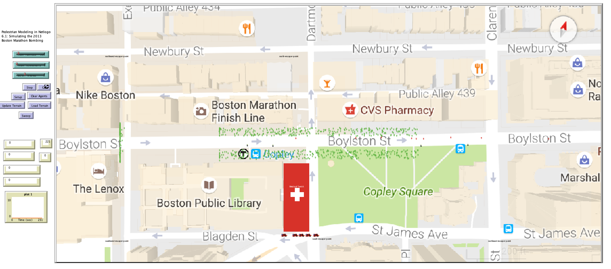

# Pedestrian Modeling: Simulating The Boston Marathon Bombing

## Abstract
 
"The model was built in NetLogo and is a simulation of the finish line of the Boston Marathon during the April 15th bombing in 2013. The simulation includes crowd behavior for escape after the terrorist bombs are ignited, and most closely follows social identity theory. The objectives for the model are to estimate impacts to crowd egress under a variety of settings including crowd density, blast size, and number of terrorists in the crowd. The crowd uses a social identity form of behavior as opposed to the entrapment (fight or flight) model or the social attachment model. The attachment model would have groups moving and finishing their escape in distinct clumps."

## &nbsp;
The NetLogo Graphical User Interface of the Model: 

## &nbsp;

**Version of NetLogo**: NetLogo 6.1.0

**Semester Created**: Fall 2016.

