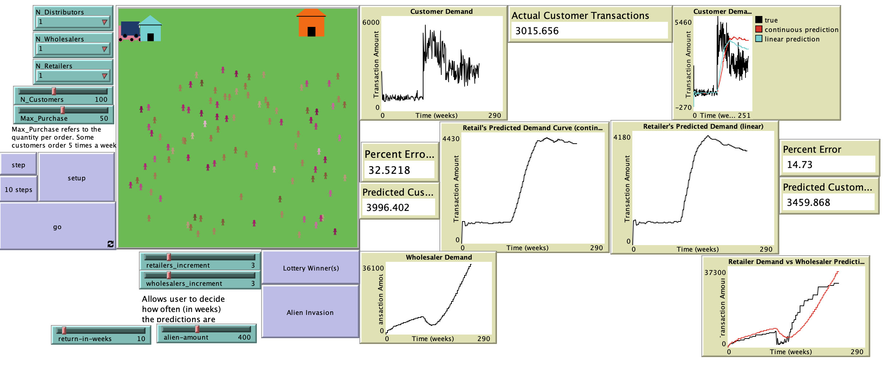

# Intrinsic Factors Influencing The Bullwhip Effect

## Abstract
"Accompanying any market’s supply chain comes a bevy of phenomena resulting from just the semi-predictable nature of agents interacting in the market alone. Setting aside the impact of technological advances and societal changes, one can see that even brief hiccups and irregularities can cause rippling effects through a supply chain. The Bullwhip Effect is an example of a phenomena where this happens. Using NetLogo to construct a supply chain fueled by individual consumer agents and pseudo-random events targeted solely to disturb consumer demand, an environment constructed to facilitate the controlled occurrence of the Bullwhip Effect was ready. Moving up the supply chain to retailers, these agents were tasked with predicting the demand of the consumer agents such that the retailer can ensure it has enough stock to supply all of its customers and stay above its buffer without overstocking on goods. This pattern of gaining demand info, predicting the next cycle of demands, and then providing a demand to the next node of the supply chain continues through the wholesaler agents and then into the distributor agents. Using this environment, intrinsic factors of the Bullwhip Effect can be tested to see how this phenomena can be mitigated."

## &nbsp;
The NetLogo Graphical User Interface of the Model: 

## &nbsp;

**Version of NetLogo**: NetLogo 6.1.0

**Semester Created**: Fall 2019.

