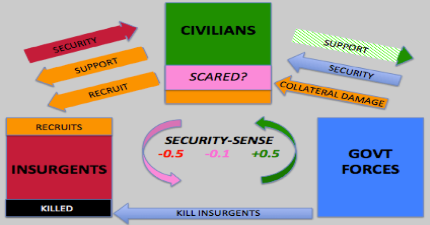
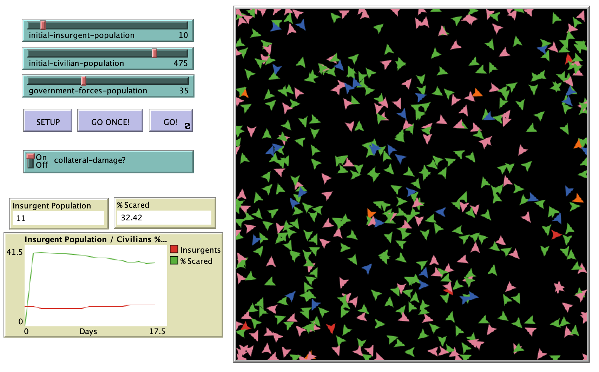

# Counterinsurgency Force Planning Ratio:  Analyzing The U.S. Military’s Published Minimum Force Planning Ratio For Coin Operations Through The Use Of An Agent-Based Model

## Abstract 

"The following paper presents an agent-based model focused on examining the U.S. military’s published minimum force planning ratio for counterinsurgency (COIN) operations.  The model attempts to replicate a simplified COIN environment in order to address whether the U.S. military’s published COIN ratio is sufficient for U.S. forces to achieve success."

## &nbsp;
Proposed COIN Conceptual Model:

The NetLogo Graphical User Interface of the Model: 

## &nbsp;

**Version of NetLogo**: NetLogo 6.1.0

**Semester Created**: Fall 2013

