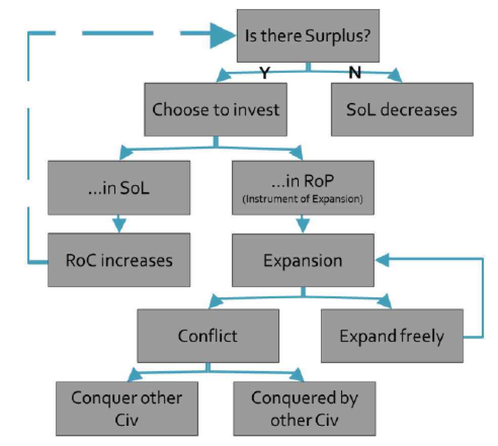
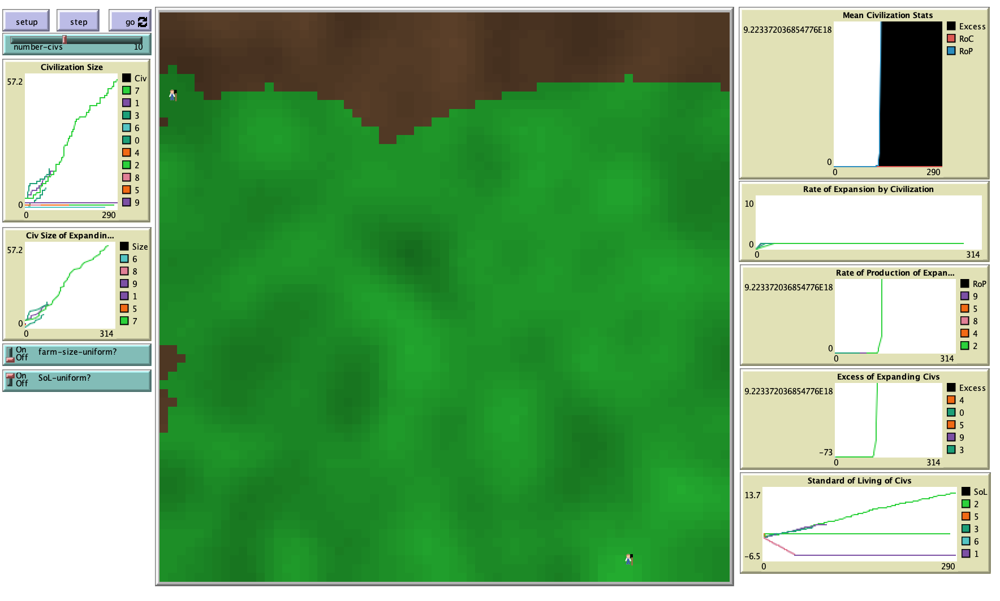

# The Evolution Of Civilizations: A Study Of Civilization Growth Conditions

## Abstract
"The purpose of this preliminary research is to model civilization formation, expansion, and conflict, and to explore the conditions under which these processes occur. For its theoretical foundations, this research draws upon modern theories of sociocultural evolution, neoevolutionism chief among them."

## &nbsp;
Model Logic:

The NetLogo Graphical User Interface of the Model: 

## &nbsp;

**Version of NetLogo**: NetLogo 6.1.0

**Semester Created**: Fall 2018

