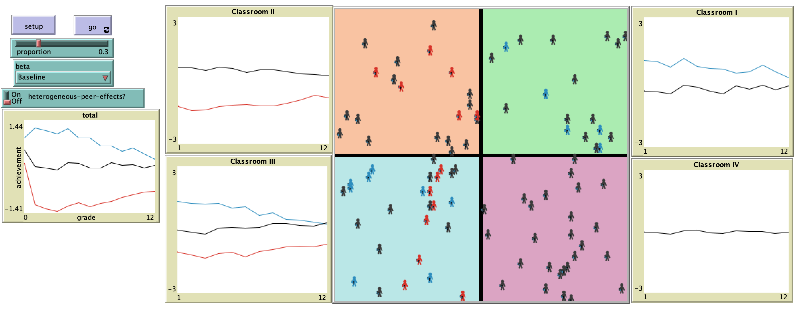

# Exploring Peer Effects and Classroom Assignment in Schools.

## Abstract
"This paper discusses a microsimulation model based on a literature review of econometric estimations on the effect of peers on educational outcomes. Other point of interest is the effect that classroom assignment has on the same variable." 

## &nbsp;

The NetLogo Graphical User Interface of the Model: 

## &nbsp;

**Version of NetLogo**: NetLogo 6.1.0

**Semester Created**: Fall 2018

