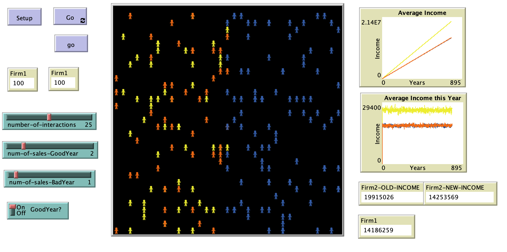

# Comparison between Real Estate Commission Policies

## Abstract
T"his agent-based model intends to compare two real estate commission policies by examining the motivation of agents in two companies. The motivation of agents is set based on their income. Both firms follow the 3% break down of the settlement price of property. The difference is observed in the intercompany commission split. Firm 1 rewards its realtors by changing the 50%-50% split into 90%-10% when the agents reach $18,000 in commission. Firm 2 rewards its realtors by setting a higher share of 64%-46% for them and applying a ‘profit sharing’ method." 

## &nbsp;
The NetLogo Graphical User Interface of the Model: 

## &nbsp;

**Version of NetLogo**: NetLogo 6.1.0

**Semester Created**: Fall 2015

