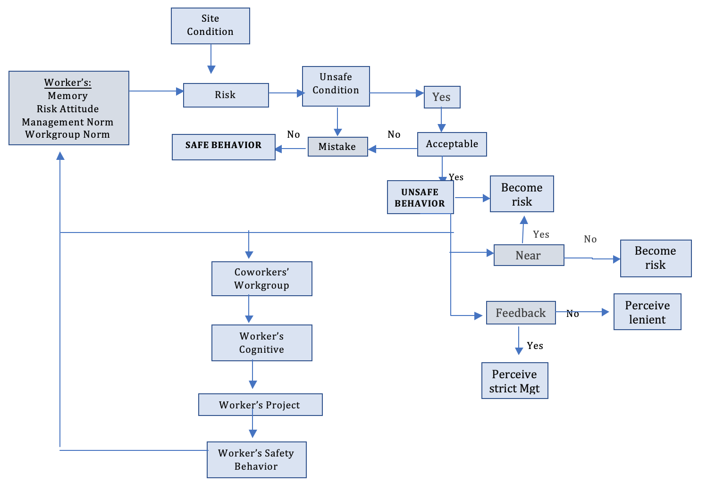
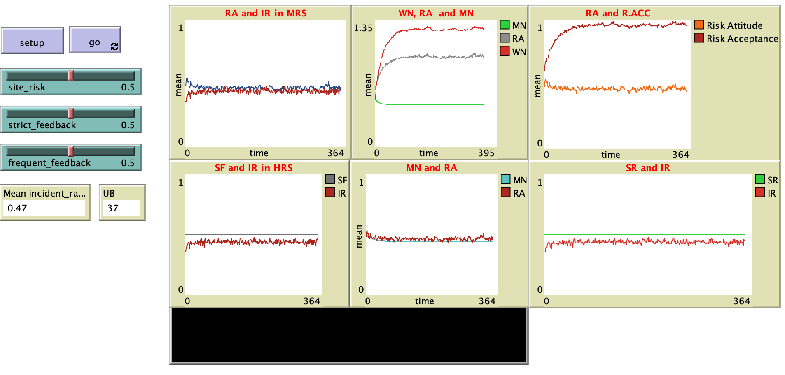

# Avoid Shortcuts: Investigating the Impact of Management Interventions and Social Influence on Construction Workers’ Safety Behavior.

# Abstract
"The rate of incidents as a result of the unsafe behavior of workers has been a major concern in the construction industry. Various attempts have been geared towards improving the safe behavior of workers using different methods like safety trainings, incentives or punitive measures. Agent-based modeling is a relatively new approach employed in construction used to simulate the actions and interactions of autonomous agents (construction workers) individually or collectively in order to evaluate the impact of various combinations of variables on safety performance. The model attempted to simulate the interaction of construction workers n low, medium and high-risk sites by investigating the impact of management interventions, risk-taking personalities and social influence on workers’ safe behavior. The results demonstrated that strict and frequent management feedbacks were effective on the three sites. However, frequent management feedback achieved more remarkable reduction in the incident rates of the three sites than strict feedback. Workers’ risk-taking personalities was shown to affect their safety decisions and directly impacted the rate of accidents on the sites. Safety decisions were also affected by the social influence of their workgroups. Workgroup norms were reinforced with increasing level of risks and the observation of co-workers risk acceptance." 

## &nbsp;

Flowchart Of Agent’s Behavioral Rules:

The NetLogo Graphical User Interface of the Model: 

## &nbsp;

**Version of NetLogo**: NetLogo 6.1.0

**Semester Created**: Fall 2018

