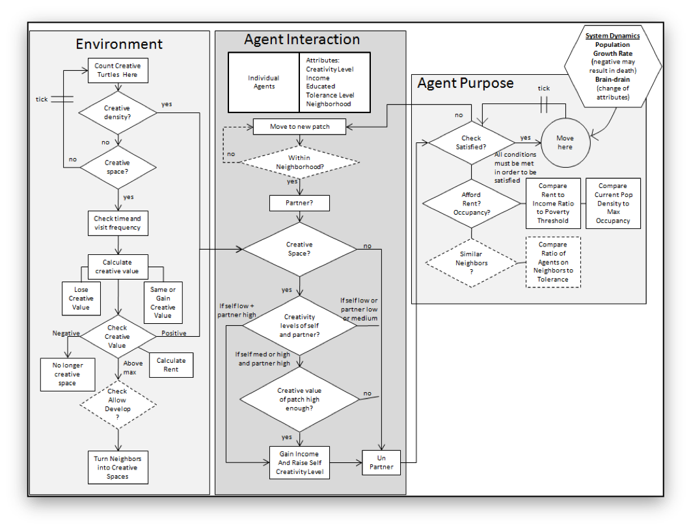
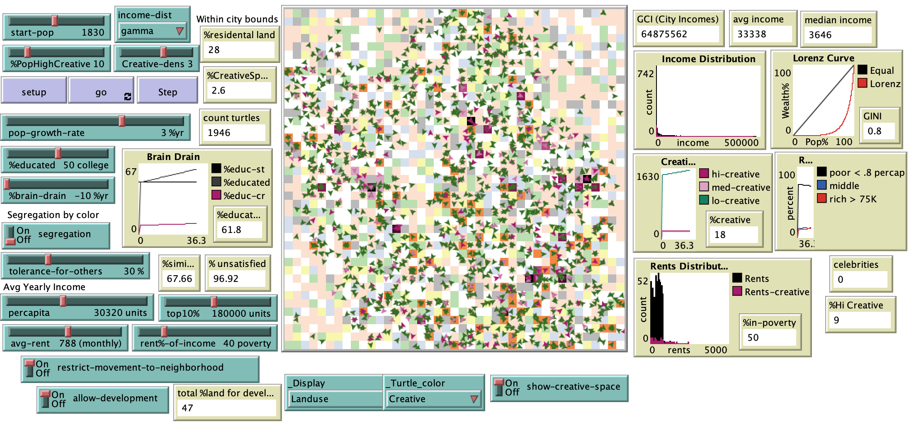

# Pakistan’s Urban Challenge: An Agent-Based Model of Karachi

## Abstract

"This is an ABM of urban creativity in Pakistan aimed at developing a deeper understanding of underlying socioeconomic factors inhibiting creative thinking. Beginning with individual level psychology, the model abstracts society wide factors impacting the formation of creative clusters. In the process for example, we will simulate the impact of greater social and physical mobility on creative outcomes, thus offering urban planners some unique insights into possible scenarios for Karachi’s future."

## &nbsp;
Model Logic Flow Diagram:

The NetLogo Graphical User Interface of the Model: 

## &nbsp;

**Version of NetLogo**: NetLogo 6.1.0

**Semester Created**: Fall 2012

