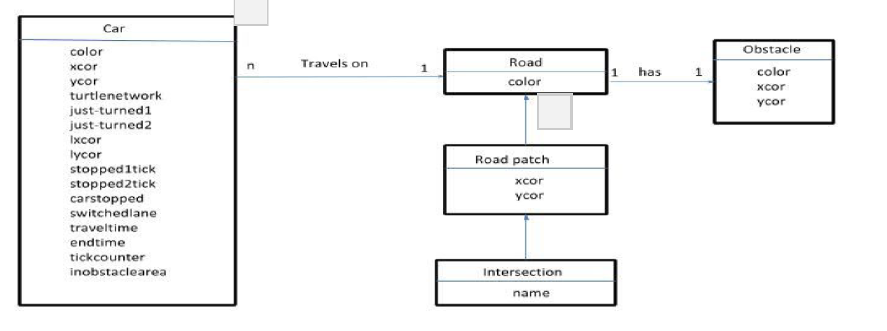
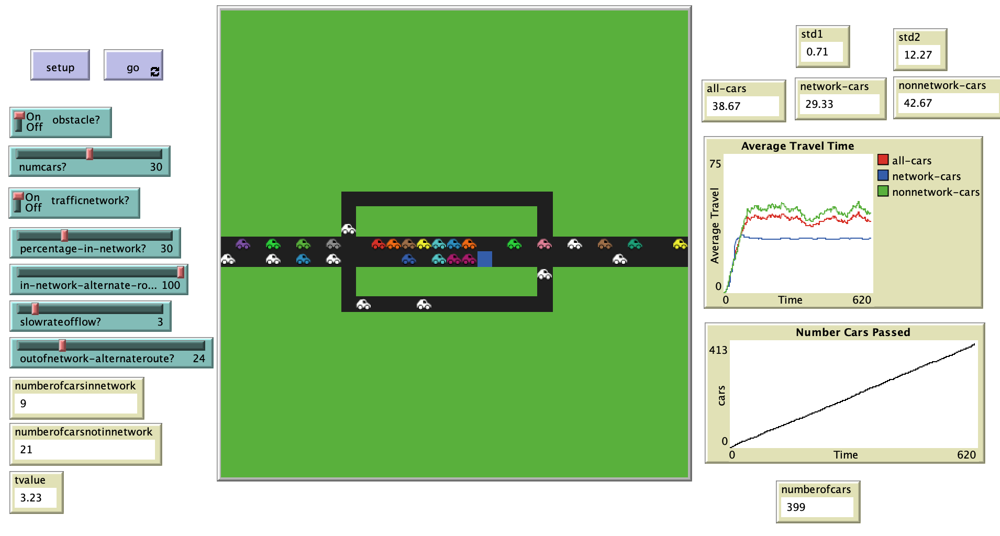

# Modelling the Effects of Crowdsourced Traffic Data on Traffic Flow: An Agent Based Approach

## Abstract 
"In recent years, more mobile phone users are relying on crowdsourced data from traffic apps such as Google Maps and Waze in order to get real time traffic alerts, and to reach their destinations in the shortest amount of time. Moreover, traffic congestion remains a daily
problem in people's’ lives. Research is currently being done to tackle this problem included collecting more crowdsourced data, creating better routing algorithms, and applying data mining techniques to predict accident and driver behavior. In this paper, we build a simple agent-based model using NetLogo to capture some of the effects that widespread use of such traffic apps can have on the overall flow of traffic. The model includes agents who use traffic apps and agents who do not. During traffic congestion, a certain percentage of traffic app-using agents choose to take an alternate route to their destination."

## &nbsp;
UML model of Traffic simulation:

The NetLogo Graphical User Interface of the Model: 

## &nbsp;

**Version of NetLogo**: NetLogo 6.1.0

**Semester Created**: Fall 2016.

