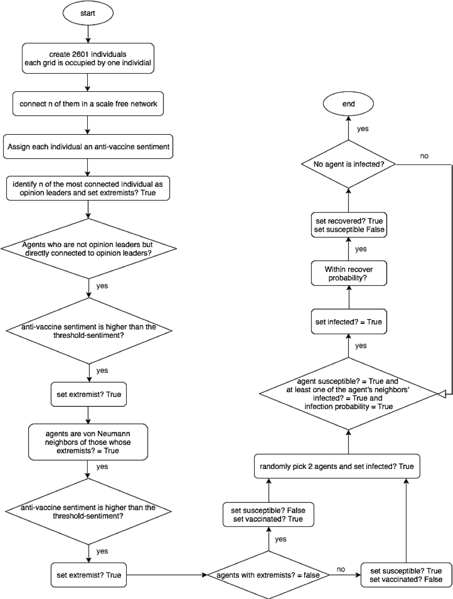
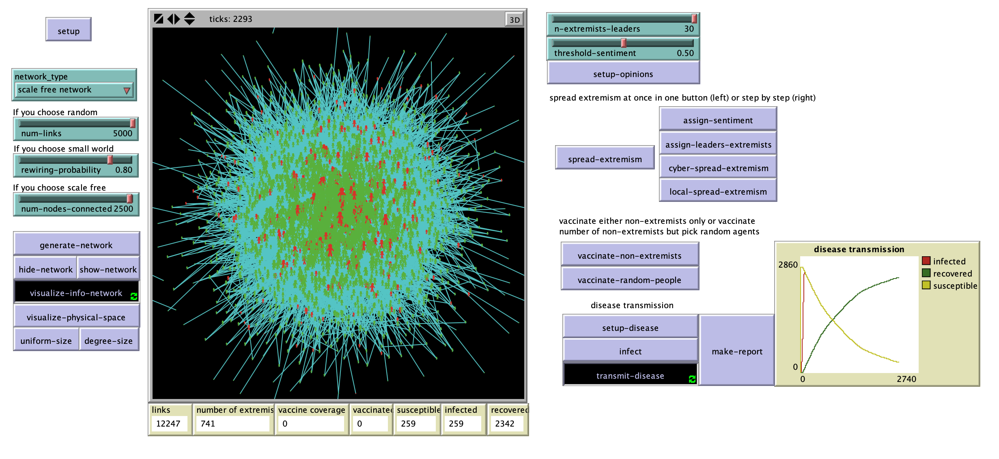

# From Cyber Space Opinion Leaders and the Spread of Anti-Vaccine Extremism to Physical Space Disease Vulnerable Clusters

## Abstract
"Measles, according to World Health Organization (WHO), is one of the leading causes of death among young children. In some developed countries in North America and Europe where the coverage of Measles vaccine is as high as more than 85%, Measles outbreaks are still happening each year. Many research has demonstrated that one of the reasons underlying the paradox of high vaccine coverage and Measles outbreaks is the ineffectiveness of “herd immunity” with the false assumption that people are mixing randomly and there’s equal distribution of vaccinated population. In reality, the unvaccinated population whose parents believe that MMR vaccine is not safe/effective for their children is clustered (disease vulnerable clusters). Meanwhile, Internet has been one of the most important information sources for parents to get vaccine knowledge. In this paper, I propose an agent-based model that separates cyber space where opinions and information diffuses and physical space, in which both opinion and disease transmits. The model shows that online anti-vaccine extremism opinion leaders have a disproportionate influence in the spread of such extremism sentiment even when the majority of the population are supportive and thus creates physical space disease vulnerable clusters."

## &nbsp;
Flowchart of the model process and logic:

The NetLogo Graphical User Interface of the Model: 

## &nbsp;

**Version of NetLogo**: NetLogo 6.1.0.

**Semester Created**: Fall 2016

