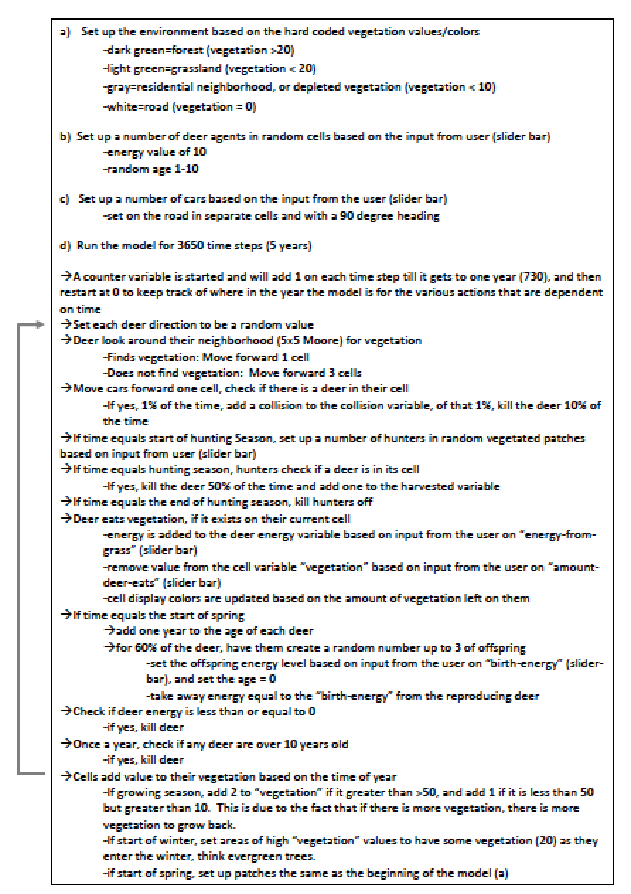
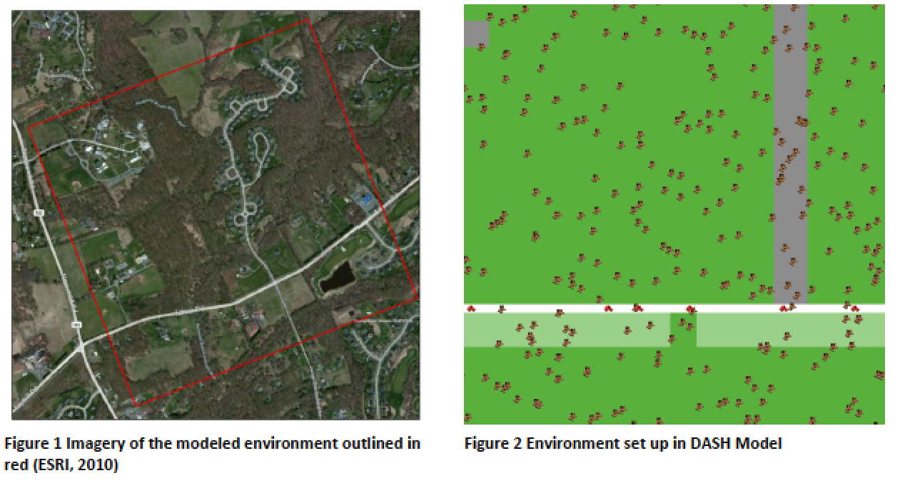
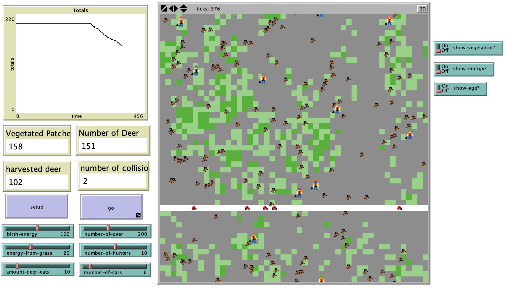

# Deer Against Suburban Hunters (DASH): An Agent Based Model of a Population of Suburban Deer and their Effects

## Abstract: 

"Taking a look at the problem of deer overpopulation common in many suburban areas experiencing urban sprawl, this study creates a deer population model. The model is an agent based model in which deer interact with the vegetation on the land, cars on a road, and hunters in a forest. The goal of the model is to determine if the development of the agent based model could be successful in determining the cultural carrying capacity of the deer population. The cultural carrying capacity is defined as the deer population level in which negative deer human interactions are kept at a reasonable level. Negative deer-human interactions in this model include collisions of cars and deer, and depletion of vegetation by deer during the growing season. The model is successful at displaying emerging relationships between deer population levels, harvesting levels, and the deer-human interactions which could be used to develop policy on appropriate hunting or harvesting allowances. Deer population managers could use this model, if developed further, to predict what changes in certain parameters would have on their area of interest. This model is purely designed but provides an excellent framework in which a more robust, and empirical model could be developed."

## &nbsp;
Model Logic:

Abstracting from the real world into a model:

The NetLogo Graphical User Interface of the Model: 

## &nbsp;

**Version of NetLogo**: NetLogo 6.1.0.

**Semester Created**: Spring 2012
