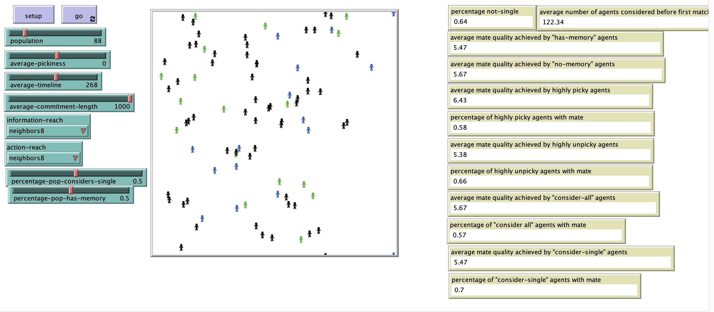

# An Agent-Based Model of Dating

## Model Description 
"There are two breeds of agents in the model: green and blue. Agents exist in a spatial environment. They move randomly through this spatial environment. If two agents of the opposite color encounter each other, they consider matching with each other. Both agents must agree to a match for it to occur.  Their cognition regarding whether to consider a match depends on several agent attributes.

Agents have a quality attribute, a numeric variable serving as their value on the dating market (with a highly desirable agent having high quality). Agents have a pickiness attribute, a numeric variable corresponding to a threshold which potential partners must clear for the agent to match with them. Agents have timeline, which refers to the number of time-steps that the agent will stay single before considering any match; this is intended to capture that many people defer romantic relationships for some time to accommodate other goals (e.g., educational or professional advancement). When evaluating a potential partner, agents create a valuation of that partner that is based on the partner’s absolute quality, the difference between their own quality and that of the potential partner, and agent perception of market alternatives. This market perception is complex and discussed in detail later.

If both agents’ valuation of each other exceeds market alternatives, and other conditions (e.g., pickiness and timeline) are met, the two agents become partners. Their looking? attribute becomes “no” (note that agents only will match if this is “yes”). They no longer move in the spatial environment. They no longer consider potential partners, nor do other agents consider them. The relationship lasts for some duration. When the relationship concludes, both agents begin moving and considering matches."

## &nbsp;
The NetLogo Graphical User Interface of the Model: 

## &nbsp;

**Version of NetLogo**: NetLogo 6.1.0

**Semester Created**: Fall 2016

