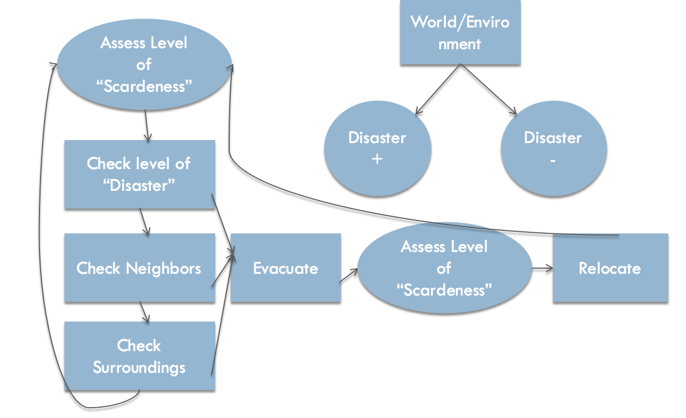
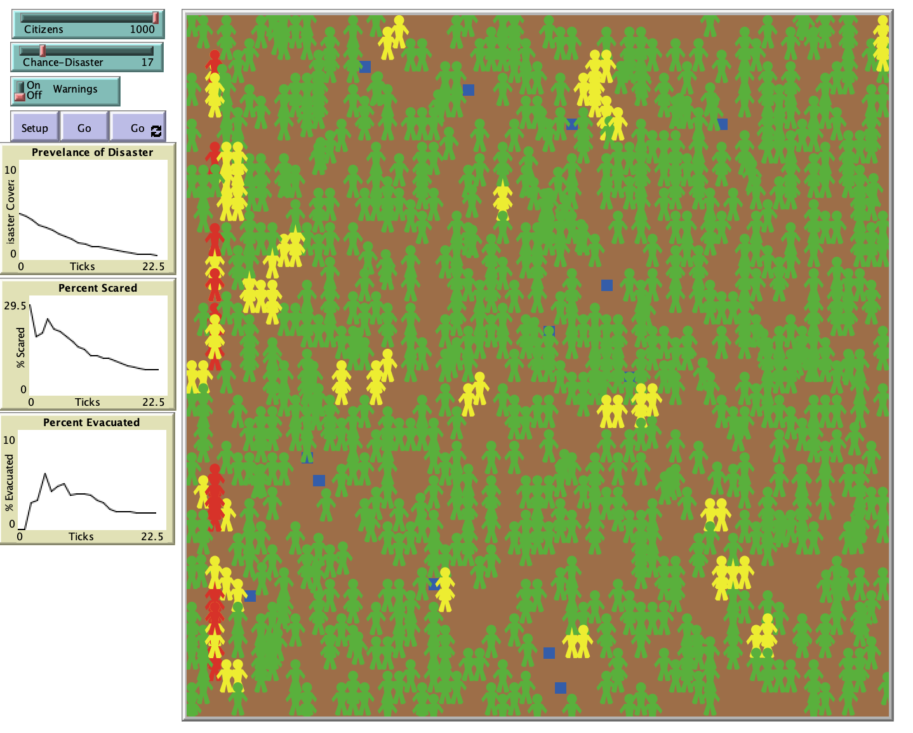

# Crisis Prevention and Management: The Use of Agent Based Models in Human Disaster Reaction

## Abstract
"The overall purpose of this model is to gain both general and specific insight into the seemingly irrational behavior exhibited by some humans during times of crisis and disaster. Why do some people leave an area well before a disaster strikes? Why do some people then wait until the last minute to depart; and some still never evacuate until their lives or the lives of their families are at stake? If these actions and behaviors can be simplified and transferred into agent behavior, then perhaps a simple model can replicate the more complex and dynamic behavior exhibited by humans during a chaotic and disastrous situation."

## &nbsp;
Model Logic:

The NetLogo Graphical User Interface of the Model: 

## &nbsp;

**Version of NetLogo**: NetLogo 6.1.0

**Semester Created**: Fall 2015

