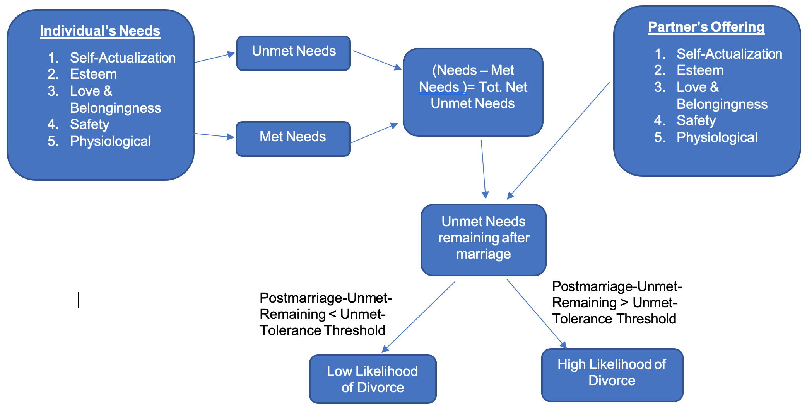
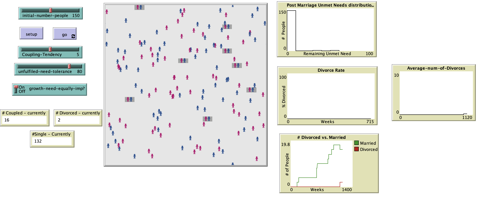

# Marriage, Divorce and Maslow’s Hierarchy of Needs: An Agent-Based Model of Divorce Rates.

# Abstract
"It is commonly known that half the marriages in the US end in divorce. However, the divorce rates in the US have fluctuated over the past several decades, with the recent years showing a declining trend. The present study attempts to model divorce rates in a population. It explores how the various factors drive divorce and whether the recent decline in divorce rates or past trends can be explained by the model. 

Drawing inspiration from Finkel et al (2015), this study considers marriage in relation to Maslow’s hierarchy of needs. Maslow’s hierarchy represents human needs in the form of a pyramid, with the basic needs – Physiological, Security, Love and Belongingness – at the bottom and higher-level, psychological needs such as Esteem and Self-Actualization at the top. An individual seeks to fulfill needs from bottom up. Finkel et al. suggest that marriage can serve different purposes and the purpose has shifted on societal level over the time. In the past (Institutional era period and companionate era), a family needed to work together as a unit for basic sustenance; marriage supported the spouses’ economic stability, and fulfilled security and love related needs. In more recent times (self-expressive era), however, emphasis is placed on spouses supporting each other’s personal growth. Consequently, the focus of marriage has shifted or rather extended to higher-level needs such as esteem and self-actualization. 

Using this premise an agent-based model was developed. In order to model divorce based on this premise, the model first considered individual’s standing on Maslow’s needs independent of marriage, using the attributes – Met Physiological Needs, Met Safety Needs, Met Love and Belongingness needs, Met Esteem needs and Met Self-Actualization needs. (Although Maslow’s hierarchy places the needs in the order they are important for a person’s wellbeing, the difficulty of accomplishing these needs may be relatively irregular e.g., a professionally successful person may have met Self-Actualization need, but may still be lacking on Love and Belongingness). The individual’s status on these needs were then used as a reference to estimate the individual’s expectation from marriage. That is, from marriage, an individual expects to fulfill at least a certain percentage of their needs (depending on their tolerance for unfulfilled needs). Additionally, individuals were assigned attributes to indicate their ability to offer support to their partners in terms of the five needs. For the more basic needs (physiological, security and love and belongingness) it was assumed that if a person has accomplished those needs then they are also capable of supporting their partners with those needs. However, with regard to higher-level needs (Esteem and Self-Actualization), accomplishment only translated to ability on a probabilistic scale. If what the individual expects for oneself matched with what the partner had to offer then the individual is considered happy in the marriage (coded using attribute: Happy?). The marriage lasts only when both the partners are happy or it is likely to end in divorce." 

## Reference:
**Finkel, E. J., Cheung, E. O., Emery, L. F., Carswell, K. L., & Larson, G. M.** (2015). The Suffocation Model: Why Marriage in America Is Becoming an All-or-Nothing Institution. *Current Directions in Psychological Science*, 24(3), 238–244

## &nbsp;

Process of Attribute Assignment:

Process Flow of the Model:

The NetLogo Graphical User Interface of the Model: 

## &nbsp;

**Version of NetLogo**: NetLogo 6.1.0

**Semester Created**: Fall 2018

