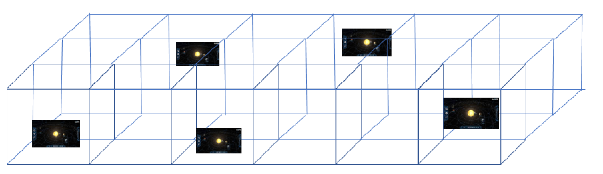
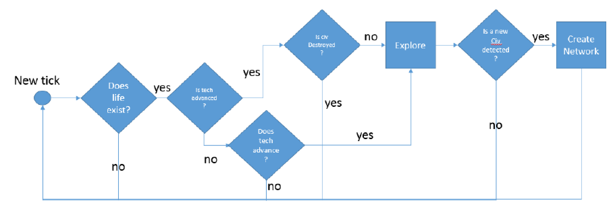
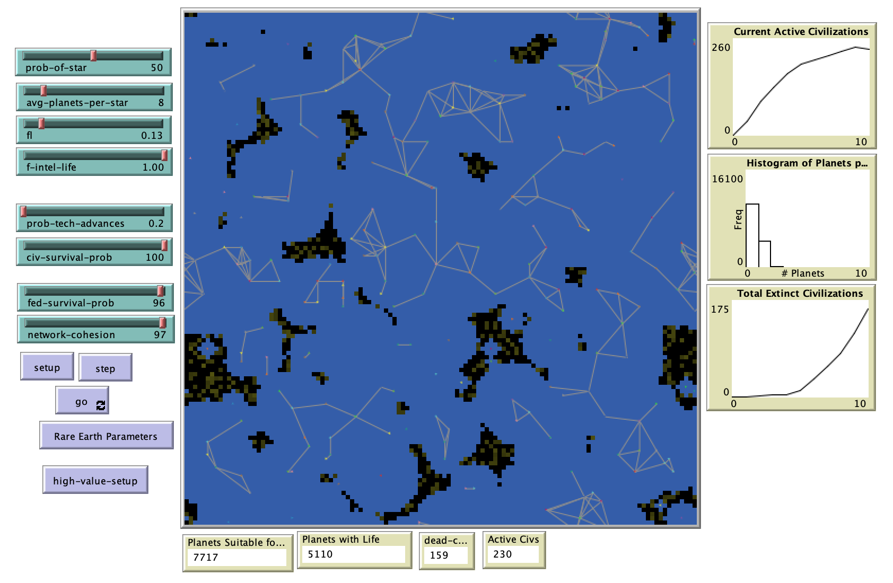

# Agent Based Implementation of the Drake Equation.

## Abstract
"The Drake Equation was developed in 1961 ahead of the first meeting of the Search for Extraterrestrial Intelligence. The equation was a thought experiment and argument to provoke discussions around the
possible existence of life outside of our solar system. The equation has continued to raise debate and discussion. This paper leverages Agent Based Modeling techniques to implement a model and simulation of the original Drake Equation. The model is used to understand how varying the parameter space impacts the evolution of life, civilizations, and inter solar system contact. The model also addresses and confirms a key point made by the astronomer Carl Sagan. Sagan argued that life in the Milky Way galaxy was plentiful, and that the ability of a civilization to not destroy itself was the key variable. This paper confirms that intuition through the Agent Based Model. Finally, ideas to improve and expand this work are provided."

## &nbsp;

Flow chart showing patch creation logic:

Representation of patch star population:

Flow chart of agent logic within the model:

The NetLogo Graphical User Interface of the Model: 

## &nbsp;

**Version of NetLogo**: NetLogo 6.1.0

**Semester Created**: Fall 2018

