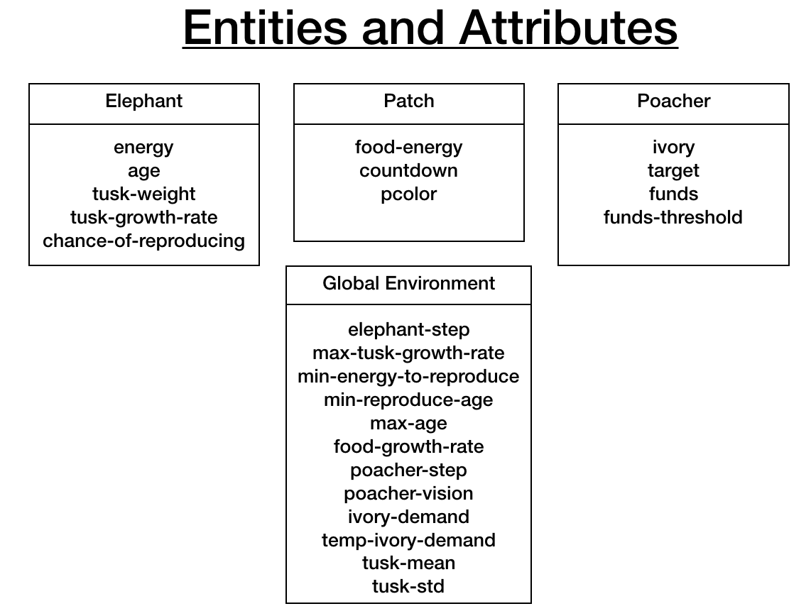
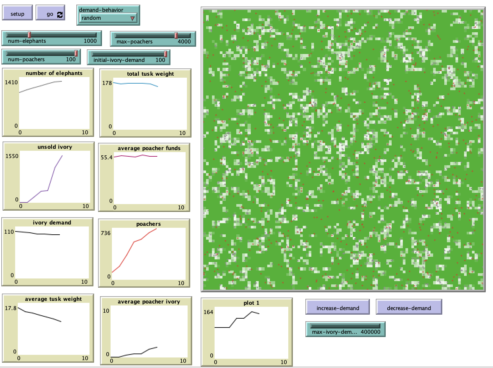

# Elephant Poaching in Africa: Agent-based Modeling for Conservation Policy

## Abstract
Ivory trade in Africa has a long history, going back to the beginning of the colonial period when Europeans began using it as an exotic status symbol. With the rise of globalization and the spread of worldwide ivory markets, supplying ivory for international demand became a lucrative industry. This was especially true for those with limited resources due to lack of education or jobs in rural areas. By the 1970s, it was becoming apparent that the ivory trade would likely lead to the extinction of the African elephant if left unchecked. However, it was not until 1989 that a treaty was signed banning the international sale of ivory. The goal of the treaty was to cut off the demand for ivory in the hope of limiting the economic utility of killing elephants, therefore allowing the population to recover. There are mixed opinions on the overall success of the ban, but it is difficult to understand the complex reasons responsible for continued elephant poaching. Agent-based modelling may be able to provide some insight into the behavior and consequences of current policy or policy changes relevant to the issue. The following is a description of a baseline model that can be expanded to test different approaches or situational parameters for curbing poaching activities.

## &nbsp;

The NetLogo Graphical User Interface of the Model: 

## &nbsp;

**Version of NetLogo**: NetLogo 6.1.0

**Semester Created**: Fall 2017

