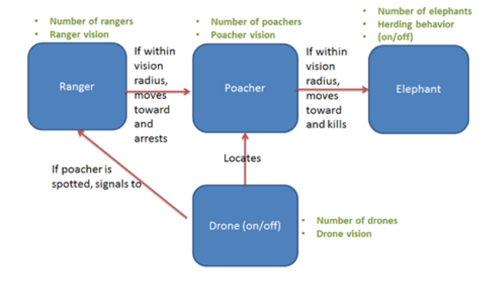
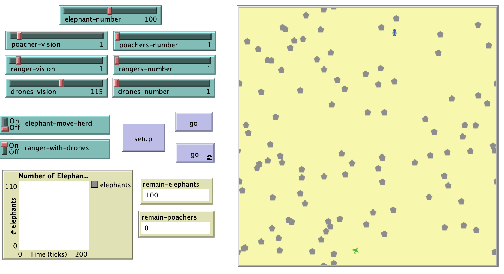

# An Agent Based Model to simulate the enforcement of illegal poaching of African elephants 

## Abstract 
"Illegal wildlife poaching is contributing to the decline of many species, especially the African elephant. Poaching of elephants and enforcement to prevent poaching using park rangers and drones was simulated using an agent based model. Key parameters included in the model included the number of each type of agent (elephants, poachers, rangers, and drones), vision of poachers, rangers, and drones, and herding behavior of elephants. Increasing the number and vision of rangers relative to the vision of poachers helped prevent the loss of elephants. Adding drones to the model also prevented loss, but only when drone vision was high enough. Findings of this study suggest that the use of drones with adequate vision to aid park rangers in the enforcement of illegal poaching is likely to be effective."

## &nbsp;
"Flow chart of model components and interactions. Agent breeds are shown in blue boxes. Associated parameters are displayed in green. Interactions are represented as red arrows." 

The NetLogo Graphical User Interface of the Model: 

## &nbsp;

**Version of NetLogo**: NetLogo 6.1.0

**Semester Created**: Fall 2014

