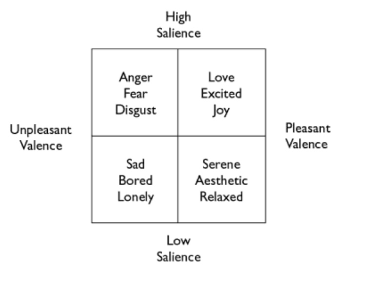
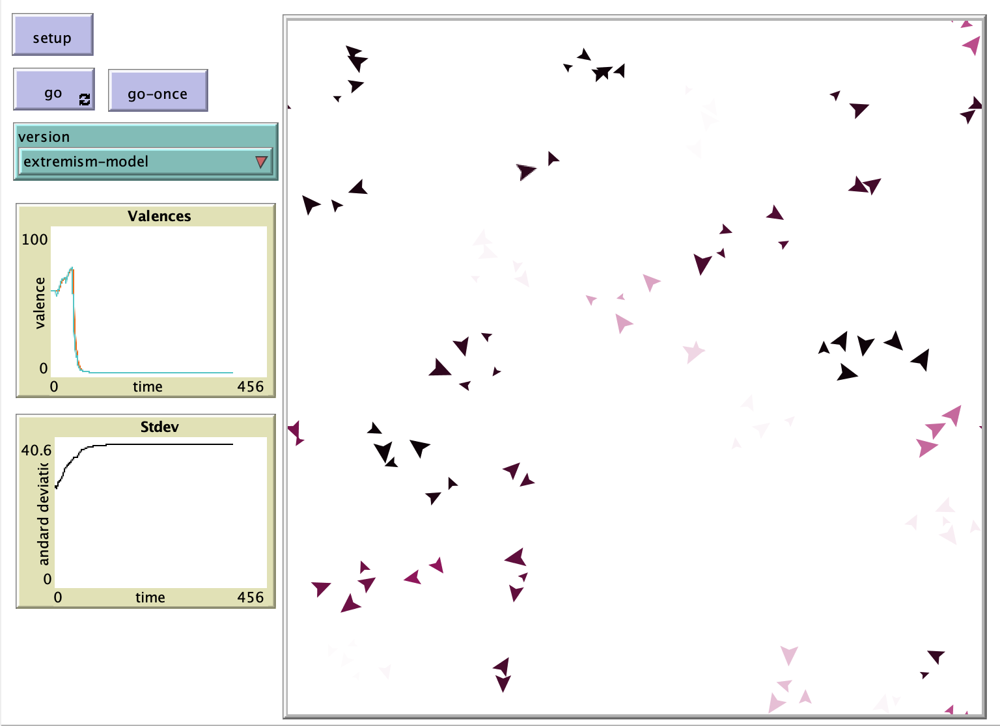

# Modeling Emotions in Groups Using Agent-Based Models

## Abstract

"In this paper we consider an as yet unresolved question in the social sciences: how do emotions function in groups? While there is little consensus about how emotions work on even the individual level, we adapt several current theories to create an agent-based model. Using these emotional agents, with their simple behaviors, we consider how their behavior adapts in groups and according to two primary theories of group behavior."

## &nbsp;
"Quadrants showing the interaction between valence and salience, and how typical semantic labels of emotions would fit onto those metrics":

The NetLogo Graphical User Interface of the Model: 

## &nbsp;

**Version of NetLogo**: NetLogo 6.1.0

**Semester Created**: Fall 2011

