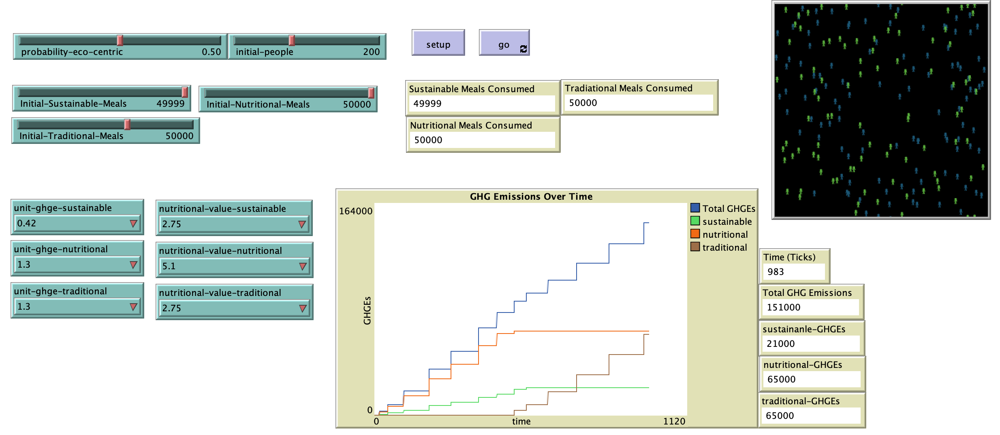

# Personal Food Choice and Greenhouse Gas Emissions

## Abstract

"As with industrial pollution and traffic pollution, the greenhouse gas emission from food consumptions is one of the most important resources of greenhouse gases emissions that will lead to global warming. Some research also prove that different kinds of food have different amount of greenhouse gas emissions through the life cycle of the food, including the emissions of cultivating, producing and cooking. Hence, how do people make their food consumption patterns matters to the environment. In our model, we defined three groups of food that are sustainable, nutritional and traditional food, and two kinds of people defined in the model that are environment centric and health centric people will eat a certain amount of food in the consequence of the ranking according which aspect they care. "

## &nbsp;
The NetLogo Graphical User Interface of the Model: 

## &nbsp;

**Version of NetLogo**: NetLogo 6.1.0

**Semester Created**: Fall 2014

