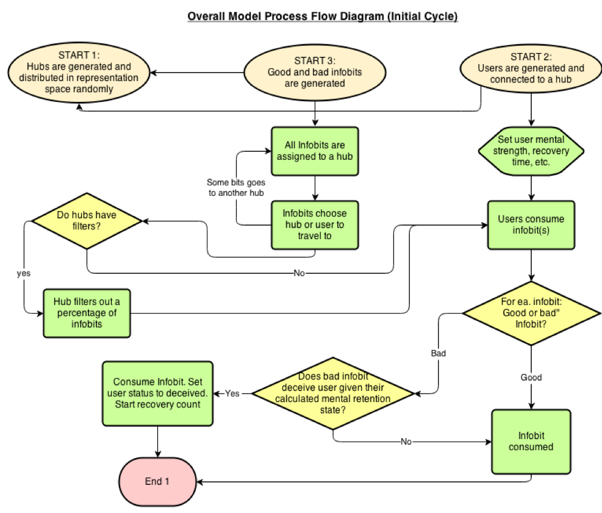
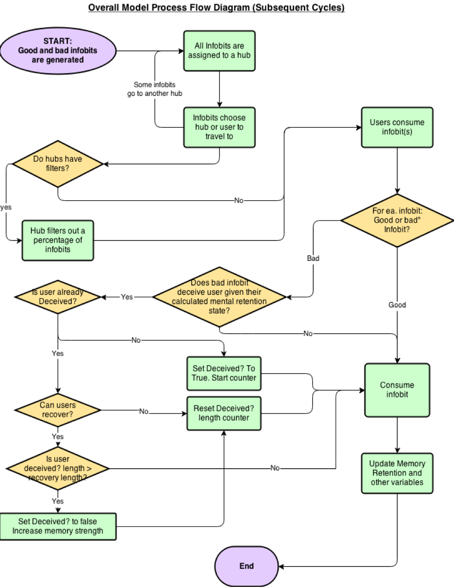
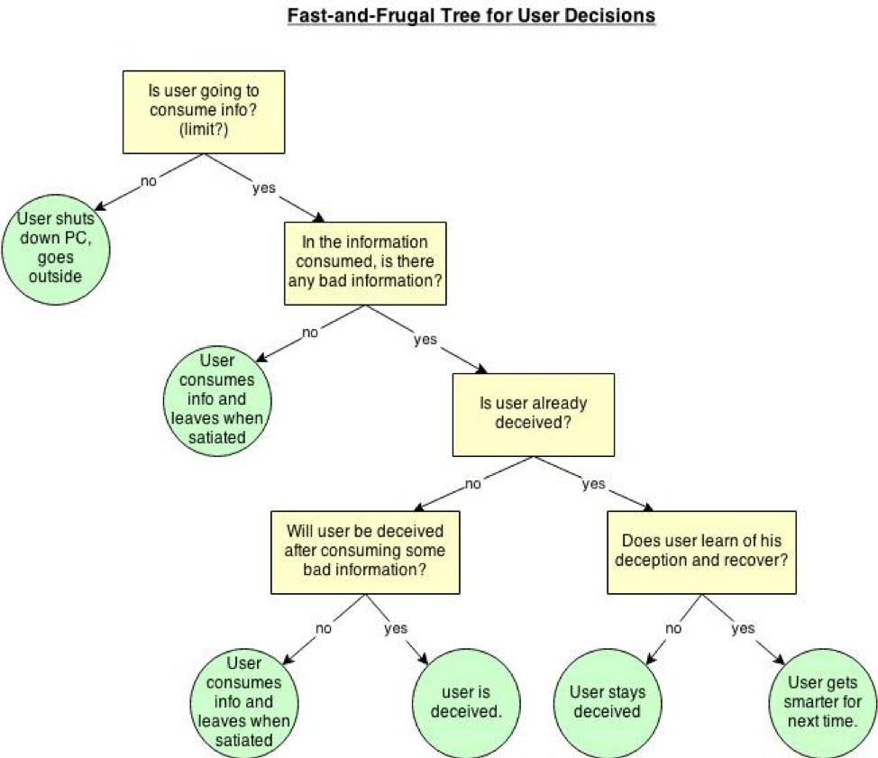
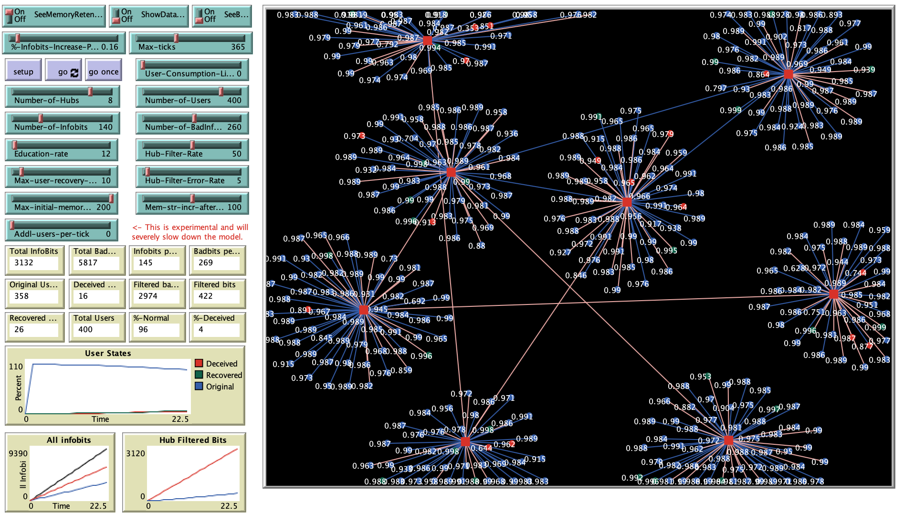

# Simulating Bottom-Up Data Generation, Consumption, and Deception based on Hermann Ebbinghaus’ Forgetting Curve 

## Abstract 

"In the past decade, a profound transformation in the way that information is produced and shared via User Generated Content (UGC). Traditionally, information is produced in a top-down fashion where experts create information for dissemination. Since the early 2000s, there has been an explosive growth of information being produced in a bottom-up fashion that is prevalent in everything from social media to product reviews. This new social method of information creation has introduced very real dangers and challenges for the consumer society at large: How can we turn to the internet for knowledge when we know it contains inaccurate or incomplete information? What are the psychological and technological factors which affect aggregate-level user deception rates online? Are methods aimed at curbing online deception, such as automated filters, policy, and education effective at preventing deception? To explore possible answers to these questions, the project will simulate information growth, network growth, and socio-psychological behaviors of information consumers within a network via agent-based modeling in Netlogo. Through simulating each individual user’s memory retention rates according to Ebinghaus’ Forgetting Curve, this project will detail the connection between an individual user’s psychology to how likely they are to be deceived in an online system. Through systematic experimentation of the model’s parameters, this project will provide statistical results of multiple model runs, as well as an examination of aggregate-level behavior." 

**Reference** 
Ebbinghaus, Hermann. "Memory: A contribution to experimental psychology." Annals of neurosciences 20, no. 4 (2013): 155.

## &nbsp;
Process Flow Diagram for the Initial Cycle:

Process Flow Diagram for all Subsequent Cycles:

Fast-and-Frugal User Decisions in the model:

The NetLogo Graphical User Interface of the Model: 

## &nbsp;

**Version of NetLogo**: NetLogo 6.1.0

**Semester Created**: Fall 2013

