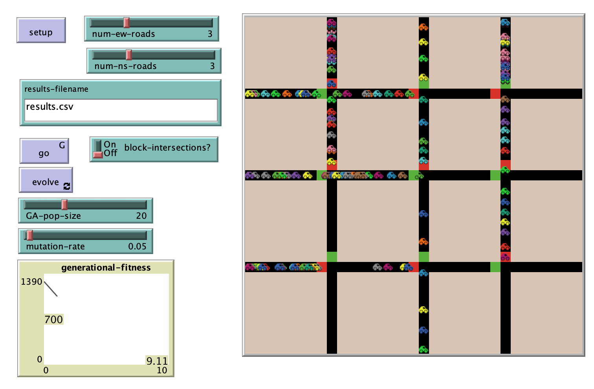

# Using a Genetic Algorithm for Optimization of Traffic Signal Timing in a Grid

## Model Description  

"For this analysis, a simulation of a traffic signal network was developed. Then, a genetic algorithm was implemented to optimize the timing of signals throughout the network. Solutions derived from the genetic algorithm were compared to analytical solutions for two different single intersection systems. The genetic algorithm was used to solve systems with two and four intersections.

The test model consisted of a traffic grid with a fixed number of east-west and north-south roads. Each intersection of an east-west and a north-south road had a traffic light. Each traffic light was operated with fixed control. The simulation was limited to automobiles as the sole mode of transportation. The model captures the interactions between two distinct agent types: intersections and automobiles. The intersections contain traffic lights and dictate when traffic can flow in a east-west or north-south direction. The automobile agents travel from a predefined origin to a determined destination. The model was designed to be able to test a variety of road configurations, so a number of scalable features were included. First, car origins can be placed anywhere on the map and used to generate cars. Second, car destinations can be placed anywhere on the map and used to remove cars from the simulation. Third, the number of east-west and north-south roads can be modified independently to generate a number of different grid layouts. In this model, cars enter the simulation from the north and west and exit the simulation from the south and east."

## &nbsp;
The NetLogo Graphical User Interface of the Model: 

## &nbsp;

**Version of NetLogo**: NetLogo 6.1.0

**Semester Created**: Fall 2013.

