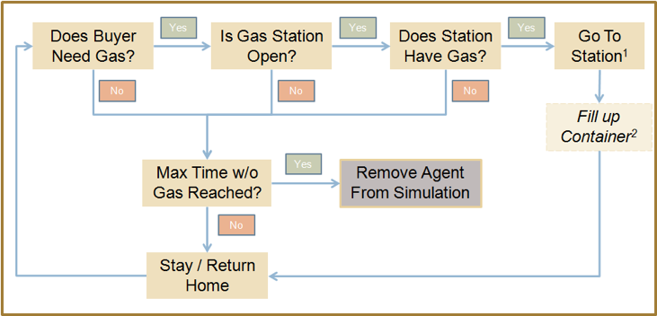

# Post-Disaster Fuel Distribution

##  Abstract
"Power outages in the wake of large scale storms and other natural disasters have become very common as the United States (U.S.) power grid becomes less reliable and more out of date. Following Hurricane Sandy, more than 8 million people were left without power along the east coast of the U.S. The number of large-scale storms has been predicted to increase in the coming years, leaving those affected looking for alternative means to temporarily provide power to their homes. In turn, this has increased the number of portable generators and standby generators sold in the U.S. As portable generators increase, the demand for gasoline during power outages will also increase as consumers will not just be using gasoline for everyday consumption (vehicles, lawn equipment, etc.), but will also use it to run their generators to maintain power in their homes. 

As a result of the increased consumption of gas, issues such as longer-than-normal station lines, an insufficient fuel supply, and an agitated public arise and present a social challenge to the local community. These challenges have been seen time and again over the last forty years in response to disasters such as Hurricanes Katrina, Irene and Sandy.  

Using agent based modeling (ABM), the Post-Disaster Fuel Distribution model was created in order to explore the walk up fuel lines seen at gas stations following a natural disaster.  The primary goal of this model is to explore and understand how and why consumers experience extreme wait times in gas station lines.  In turn, the model may be able to inform actions which could be taken to help the community distribute fuel more effectively.  This could include extending the supply of gas within the community or imposing measures to reduce wait times."  

## &nbsp;
"Post-Disaster Fuel Distribution Model Flow Chart":

The NetLogo Graphical User Interface of the Model: 

## &nbsp;

**Version of NetLogo**: NetLogo 6.1.0

**Semester Created**: Fall 2014

