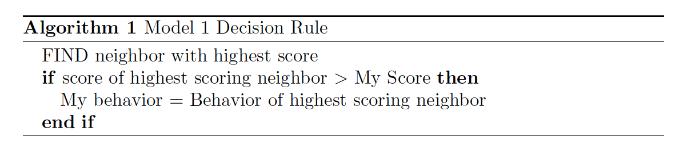
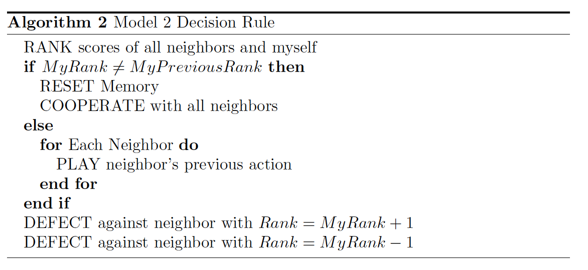
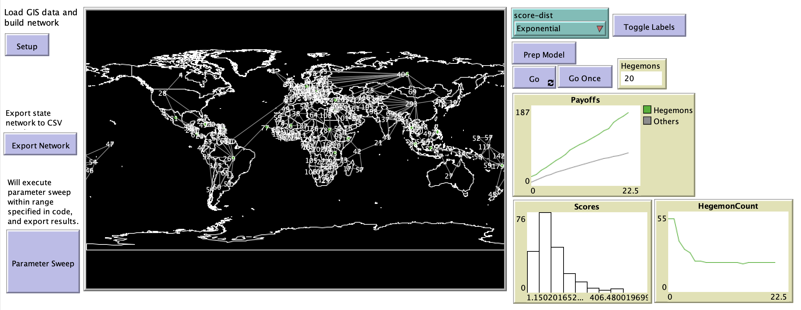

# Cooperation, Defection, and Hegemony: The Iterated Prisoner's Dilemma and Regional

# Abstract

"The prisoner's dilemma has historically been used in international relations studies to model interactions between states. In this paper, we implement several iterated prisoner's dilemma models across a GIS-derived network of state-level agents and simulate local interactions between bordering states. Our first model (Model 1) studies the evolution of regional behavioral norms; the second (Model 2) investigates bilateral interactions driven by competition for regional hegemony."

## &nbsp;
"Model 1: each state has a single behavior: it either cooperates or defects with all of its neighbors":

"Model 2 allows states to adopt a different behavior with regard to each other state; instead of a single action, each state has a table of actions, one per neighbor":

The NetLogo Graphical User Interface of the Model: 

## &nbsp;

**Version of NetLogo**: NetLogo 6.1.0

**Semester Created**: Fall 2011

