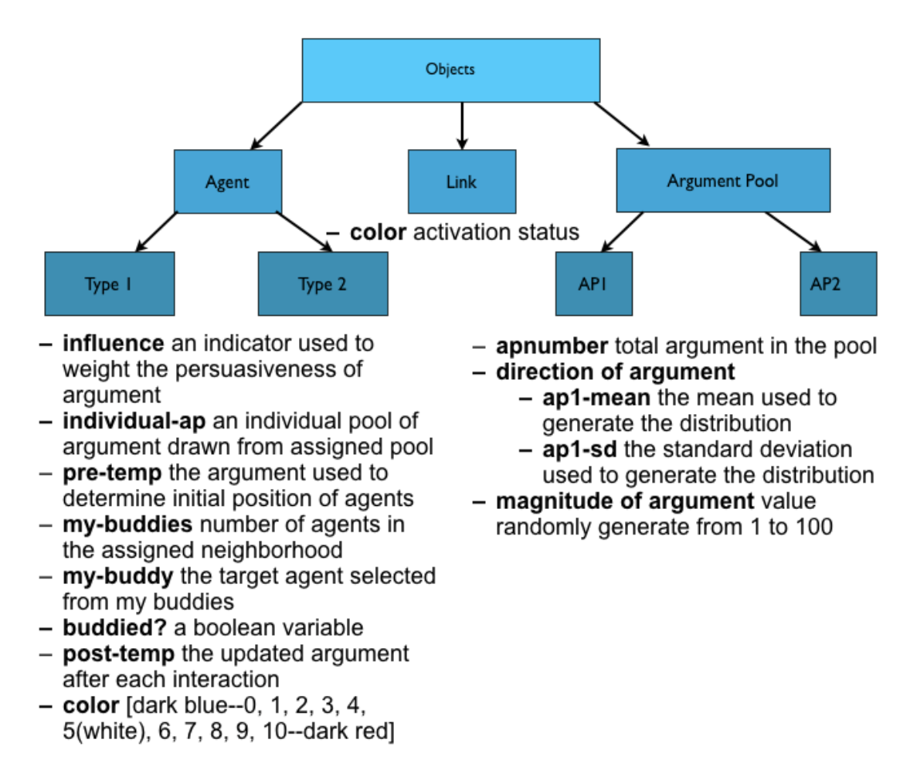
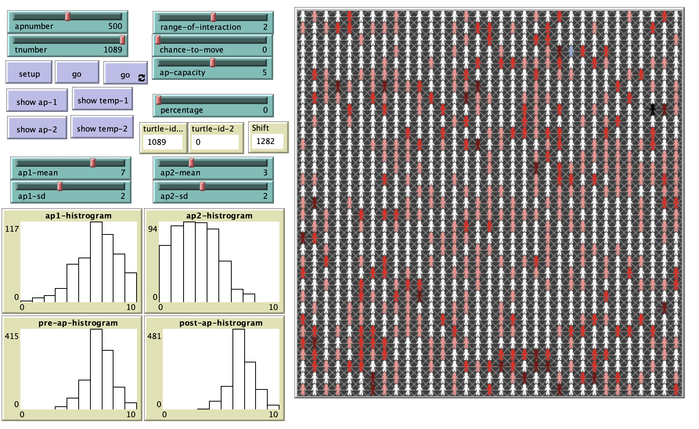

# Group Polarization: An Agent-Based Theoretical Integration

## Abstract

"Suppose a population of individuals’ aggregate beliefs regarding international trade tend slightly towards favoring protectionism.  After a sample from the larger population forms a group and discusses international trade, individuals tend to move toward even more extreme protectionist preferences.   This phenomenon is known across the social sciences as “group polarization” and its incidence is widespread throughout various enclaves of society from labor unions and political parties to book clubs and terrorist organizations.  According to legal scholar Cass Sunstein: 

"*Group polarization arises when members of a deliberating group move toward a more extreme point in whatever direction is indicated by its member’s predeliberation tendency* "(Sunstein, 2009, p3). 

More simply put, individuals’ preferences and beliefs evolve and often radicalize over time throughout the process of group interaction.  Radical and extreme beliefs and decisions may emerge in a group as a whole when individual agents continuously update their preferences after engaging in discussion with neighbors.  In this paper we seek to utilize a multi-agent system model in order to demonstrate the process by which the phenomenon of group polarization emerges through the network interaction of heterogeneous individuals holding diverse beliefs.  We develop an abstract model and hope that the insights it provides will constitute a more comprehensive synthesis of existing theories in order to better explain how the process of group polarization works."

**Reference**: 
Sunstein, Cass. *Going to Extremes: How Like Minds Unite and Divide*. New York City, New York: Oxford University Press, 2009.

## &nbsp;
The class hierarchy for the group polarization model:

The NetLogo Graphical User Interface of the Model: 

## &nbsp;

**Version of NetLogo**: NetLogo 6.1.0

**Semester Created**: Fall 2011

