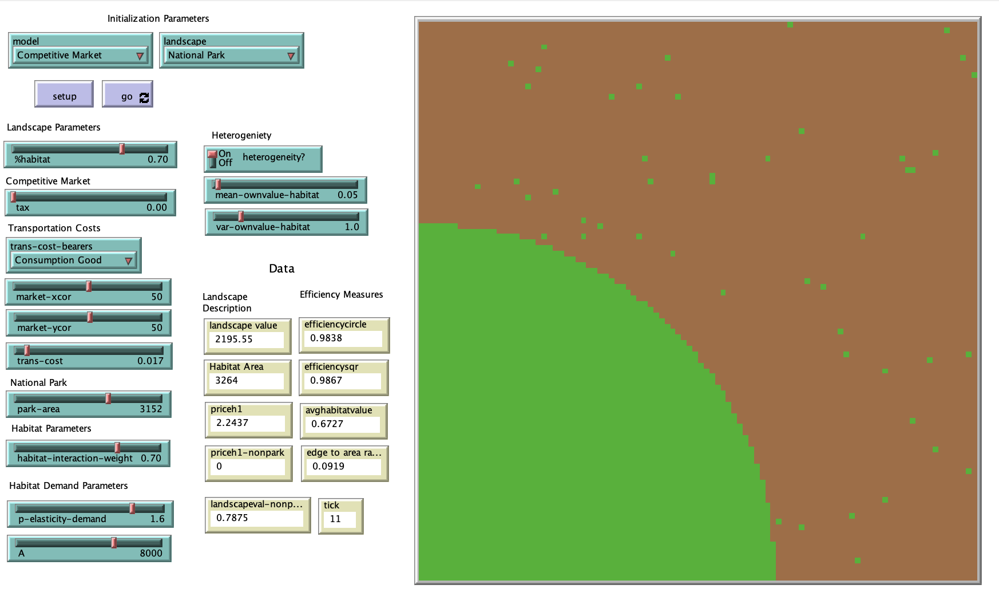

# Private Conservation and Habitat Fragmentation

## Abstract

"Habitat loss and the accompanying loss of biodiversity is essentially a problem of land use. Here an agent-based model of land use and fragmentation is presented. Agents in the model are represented by patches. Agents choose between conserving habitat or destroying the habitat and producing a good sold in a perfectly competitive market."

## &nbsp;
The NetLogo Graphical User Interface of the Model: 

## &nbsp;

**Version of NetLogo**: NetLogo 6.1.0

**Semester Created**: Fall 2011

