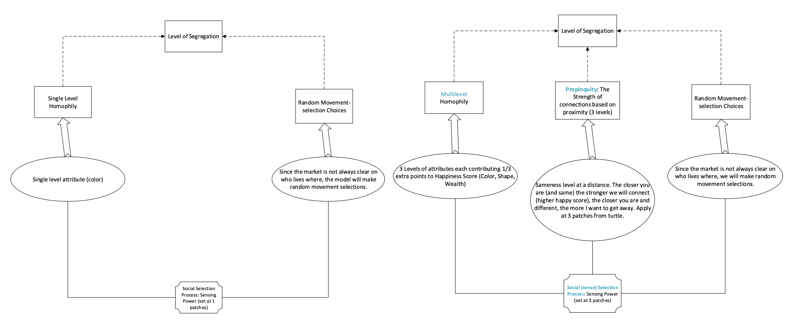
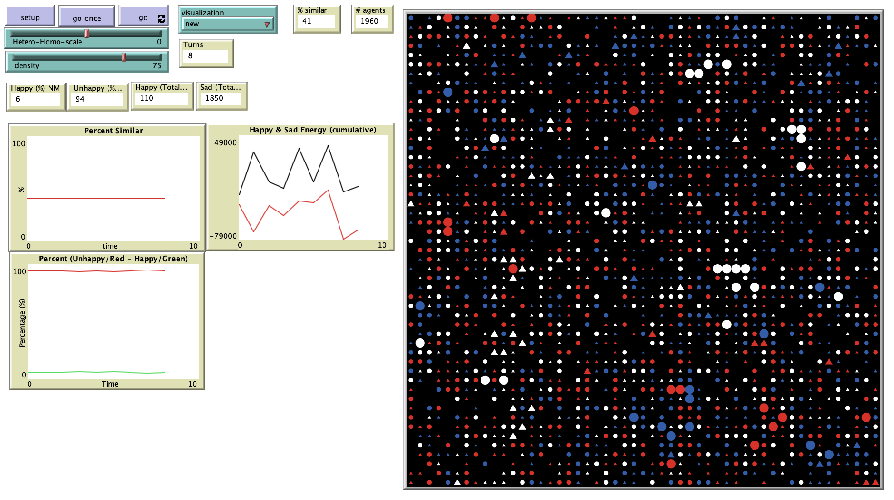

# The Impact of Homophily, Social Selection Processes, and Propinquity On Urban Housing Segregation

## Abstract
"In the process of social selection, as a subtype of natural selection, tendency towards similarity or homophily plays a key role. Some studies show that proximity and propinquity have impact on knowledge of selectors through time and space, which creates an effect on the selection process itself. As selectors know more about selectees they begin to realize dissimilarities that were previously not known to them. To examine the impact of homophily and propinquity in social selection process through interactions in time and space an Agent-Based Model is utilized as a basis for simulation. 

As a modeling platform, the original urban housing selection, which was developed based on the Schelling Segregation model in Netlogo is adopted. This model provided us with a starting point for the study and comparison of the two models through a variety of modifications, including multiple categories of attributes, multiple attributes and multiple distances at which those categories and attributes would affect agents’ selection choices."

## &nbsp;
Comparison of this modified model compared to the original Schelling model in Netlogo:

The NetLogo Graphical User Interface of the Model: 

## &nbsp;

**Version of NetLogo**: NetLogo 6.1.0

**Semester Created**: Fall 2015

