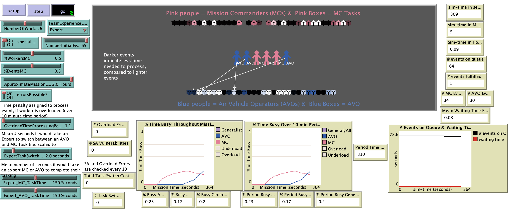

# Exploration of Future Supervisory Control Paradigms: Modeling the Human and System Performance

## Model Description

"This model simulates a team of individuals conducting two different kinds of tasks over a period of time. In particular, this model was designed to mimic an Unmanned Aerial Vehicle (UAV) operator team engaged in a mission that involves two types of tasking events: Mission Command (MC) events and Air Vehicle Operator (AVO) events. The main purpose of this model is to perform what-if analysis of the impact of team structure and worker skill level on mission performance, efficiency, and safety."

## &nbsp;
The NetLogo Graphical User Interface of the Model: 

## &nbsp;

**Version of NetLogo**: NetLogo 6.1.0.

**Semester Created**: Fall 2014

