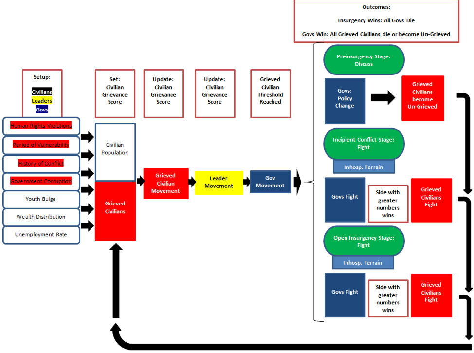
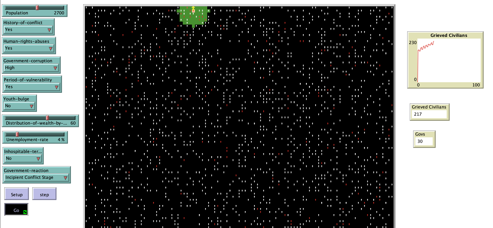

# Insurgency:  An Agent-Based Model of Conflict between Civilians and Government Authority

## Abstract 

"Insurgencies have existed for several centuries and across several countries, but today the term has become common vocabulary as the United States finds itself at least partially involved in several insurgencies globally.  By better understanding past insurgencies to include root grievances, group formation and identity, leadership, strategies, and motivations, the government is better equipped to formulate appropriate responses to the grievances or violence, whichever option is chosen.  Measuring the emergence of insurgencies through statistical analysis alone is difficult and leaves out emerging behavior.  This paper offers an attempt to explain insurgency origins with an agent-based model.   The attempt of the model is to determine what conditions lead to the emergence of insurgency and to what degree and how the timing of government reaction influences insurgent power."

## &nbsp;
The flow chart below demonstrates all parameters, movement, updates, and government reaction in the model between civilians, governments, and leaders:

The NetLogo Graphical User Interface of the Model: 

## &nbsp;

**Version of NetLogo**: NetLogo 6.1.0

**Semester Created**: Fall 2013

