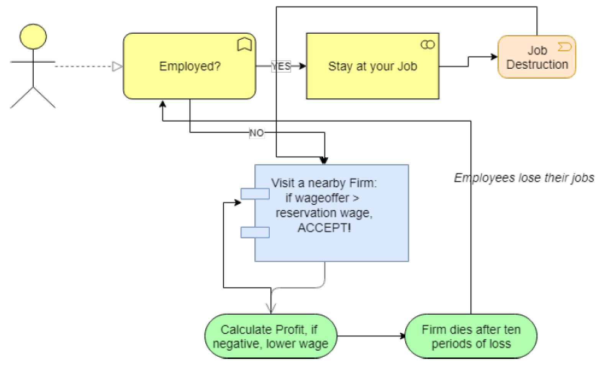
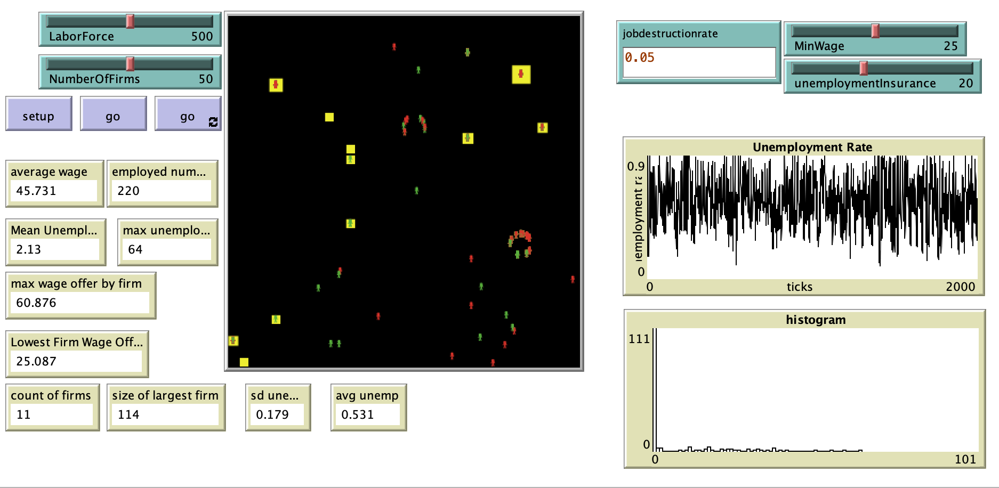

# A Model of Job Search Using Near Zero-Intelligence Agents.

# Abstract
"Using the zero-intelligence trading framework, we model a small agent-based economy where ’near’ zero-intelligence workers meet with ’near’ zero-intelligence firms to negotiate wage for labor. Allowing for firm growth, firm death, and job destruction, we find investigate the effects of minimum wage laws as well as unemployment insurance on the unemployment rate, as well as the length of unemployment spells experienced by workers." 

## &nbsp;

"A conceptual flowchart of the model":

The NetLogo Graphical User Interface of the Model: 

## &nbsp;

**Version of NetLogo**: NetLogo 6.1.0

**Semester Created**: Fall 2018

