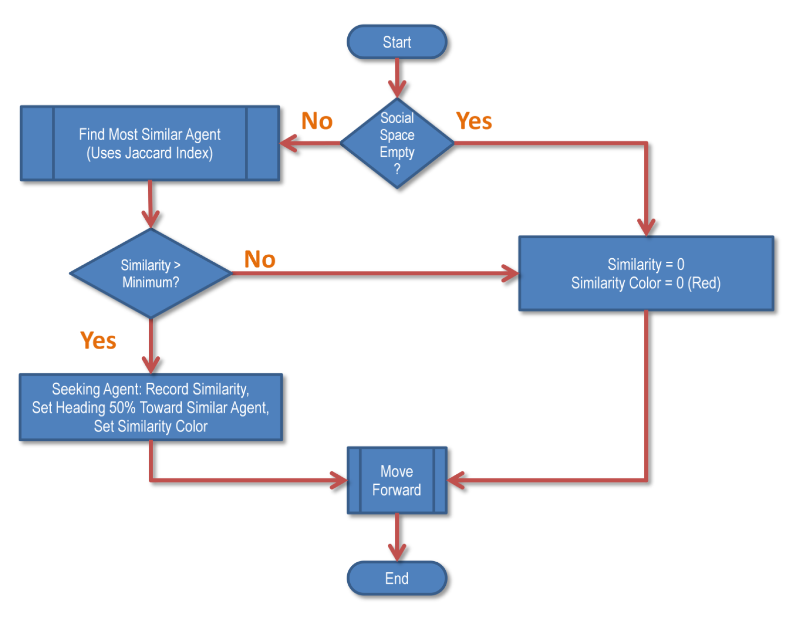
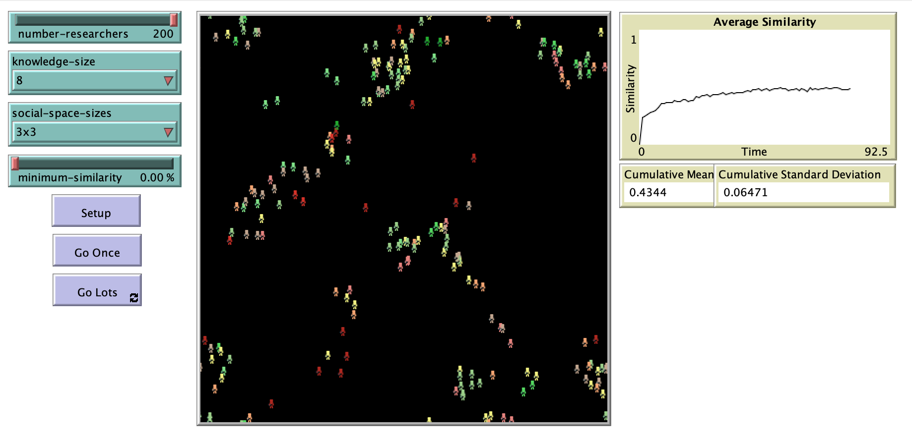

# Do Knowledge Seeking Birds Flock Together?

## Abstract 

"People are drawn toward each other based on some real or perceived similarity between them. This idea of 'homophily' has been observed when demographic or psychological similarities encourage people to form social bonds that researchers describe as networks. Knowledge, expressed as concepts, is one such psychological similarity. People can be attracted toward those with similar knowledge in work environments, conferences, and universities. This paper describes an agent based model that creates associations between agents based on how similar their knowledge is to each other while avoiding explicit social networks. This knowledge homophily was explored by measuring the agent population's similarity and visually by observing the formation of clusters. The agents form clusters and exhibit 'flocking' behavior using a single rule."

## &nbsp;
Agent decision making:

The NetLogo Graphical User Interface of the Model: 

## &nbsp;

**Version of NetLogo**: NetLogo 6.1.0

**Semester Created**: Fall 2013.

 