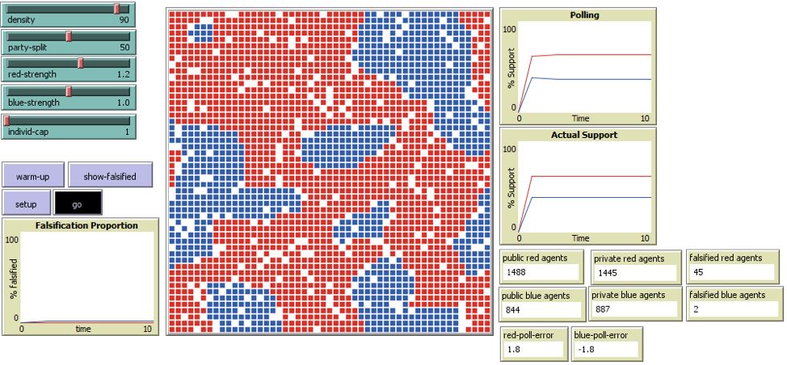

# LIARS: A Model of Preference Falsifiers and Democratic Elections

"Why did the 2016 American presidential election take people by surprise? Why, in 1982, did African-American candidate Thomas Bradley lose an election despite a double-digit lead in pre-election polling? In this paper, I apply Timur Kuran’s theory of preference falsification in the form of an agent-based model to test whether or not falsification of voting intentions could explain “Bradley Effect” type surprise election outcomes, and general polling uncertainty. This Local Interacting Agents Reporting System (LIARS) consists of interacting neighbors that weigh support and opposition from neighbors and determine whether or not to falsify based on total support weighed against total opposition. This paper hypothesizes that mild levels of preference falsification can lead to mild levels of uncertainty in voting outcomes, defined as the difference between estimated voting patterns from polls and actual voting patterns."

## Reference
**Kuran, T. (1997)**. *Private truths, public lies: The social consequences of preference falsification*. Harvard University Press.

## &nbsp;
The NetLogo Graphical User Interface of the Model: 

## &nbsp;

**Version of NetLogo**: NetLogo 6.1.0.

**Semester Created**: Fall 2019

