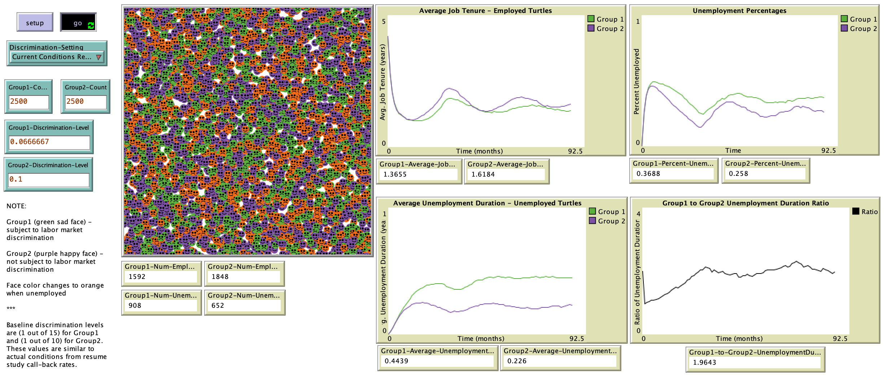

# Agent-Based Model of Hiring Discrimination in U.S. Labor Markets

## Abstract
"Agent-based modeling is applied to labor market discrimination in the U.S. labor market. Two pools of worker agents populate the model, with one group subject to labor market discrimination, and the other not subject to labor market discrimination. Firms are not present in this model specification. The model successfully demonstrates unemployment duration disparities observed in U.S. labor markets between African American and white workers. Using resume study call back rates to inform the discrimination levels, the agents subject to discrimination display similar levels of unemployment durations when expressed as a ratio against the unemployment durations of agents not subject to discrimination. Extensions of the model can be used to test popular economic theories that attempt to explain the source of discrimination in labor markets: taste based discrimination and statistical discrimination. Further applications can be made for wage discrimination and other types of labor market discrimination."
## &nbsp;
The NetLogo Graphical User Interface of the Model: 

## &nbsp;

**Version of NetLogo**: NetLogo 6.1.0.

**Semester Created**: Fall 2019

