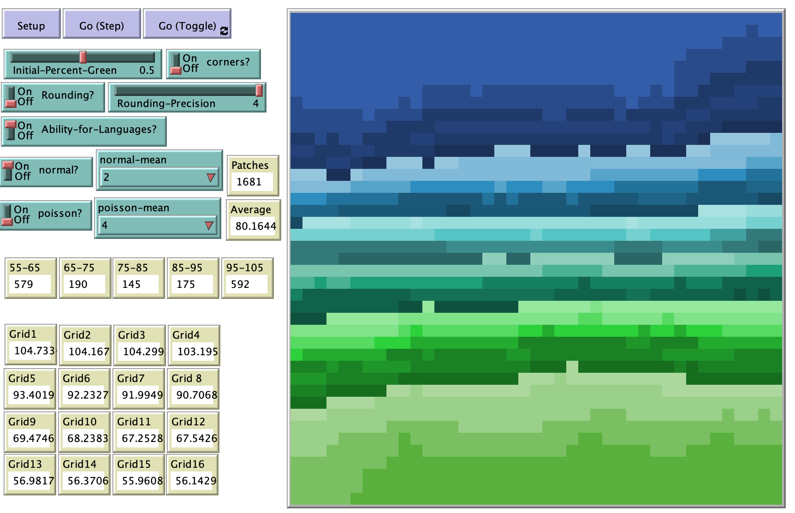

# Language Borders and the Emergence of Dialects

## Abstract 

"The purpose of this project was to create a simple, abstracted model of the creation of a new blended language along the border of separate language groups and to find a simple explanation for the existence of regional dialects.  The model was realized using the Netlogo agent-based model programming language and the results analyzed with statistical analysis of data from parameter sweeps.  Both normal and Poisson distributions of individual agent language acquisition ability yielded the creation of local dialects and also demonstrated language spread that was path dependent.  With further model development it may be possible to validate the model against real world data.  At this time the model demonstrates that simple variations in the spread of language can result in the creation of pockets of dialect."

## &nbsp;
The NetLogo Graphical User Interface of the Model: 

## &nbsp;

**Version of NetLogo**: NetLogo 6.1.0

**Semester Created**: Fall 2013

