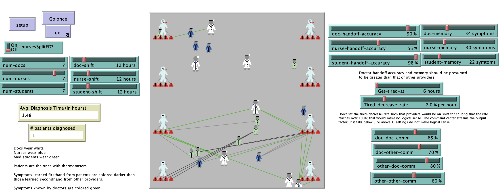

# The Hospital in My Computer: Medical Emergencies - Diagnosing by Instantiating Communication (MEDIC)

## Abstract
"Communication in a hospital is critical to ensure information gets distributed in a timely manner. Error rates in hospitals suggest that such delays are common, and likely occur at a rate higher than reported. This study seeks to utilize methods from computational social sciences to explore the antecedents that most strongly influence delays, and result in longer diagnosis times. It describes the building of an agent-based model (ABM) using NetLogo software to conceptually replicate some elements of a hospital. The model finds that number of personnel has the strongest effect on patient diagnosis times, but that communication and shift length times also have an effect. It also begins to explore the balance of longer shifts for medical providers against increased handoffs between providers."

## &nbsp;
The NetLogo Graphical User Interface of the Model: 

## &nbsp;

**Version of NetLogo**: NetLogo 6.1.0

**Semester Created**: Fall 2019

