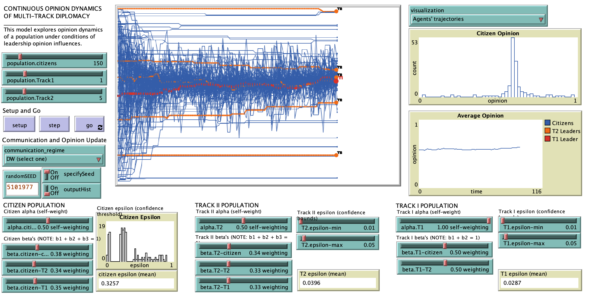

# Political Influence of Multi-Track Diplomacy on Population  Opinion Dynamics

## Abstract

Population consensus among a community or polity may lead to scenarios of positive feedback where ultimately, the momentum toward a consensus could result in outcomes that may or may not be beneficial to the community—the opinion dynamics that lead to support for a negotiated settlement or Peace Agreement might similarly lead to mass violence and genocide. Given this, additional insight into how consensus might be influenced has broad implications for the betterment of society. We extend current literature in continuous opinion dynamics modeling under heterogeneous bounds of confidence, by introducing population interaction with multi-track leadership. We theorize that the presence of multi-track political influence—in particular from non-formal, community-based authority—richly enhance the exploration of consensus formation dynamics and provides a new frame for understanding the opinion formation process. We present our extension of the Hegselmann-Krause opinion dynamics model and propose a conceptual framework to classify and characterize the political culture of a conflict scenario in a way that facilitates the calibration of our model to real-world scenarios. As a demonstrative case study, we use Northern Ireland Life and Times Survey data to parameterize our model and approximate the political climate in Northern Ireland immediately following the signing of the Good Friday Agreement.

## Final Paper:
**Horio, B. M., & Shedd, J. R. **(2016). Agent-based exploration of the political influence of community leaders on population opinion dynamics. In *2016 Winter Simulation Conference* (WSC) (pp. 3488-3499). IEEE.

## &nbsp;
The NetLogo Graphical User Interface of the Model: 

## &nbsp;

**Version of NetLogo**: NetLogo 6.1.0

**Semester Created**: Fall 2015

