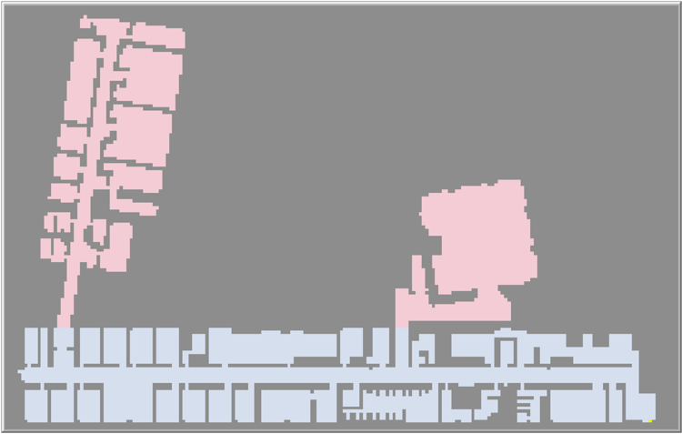
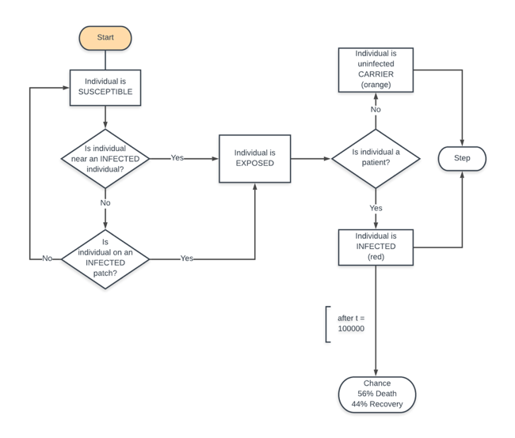
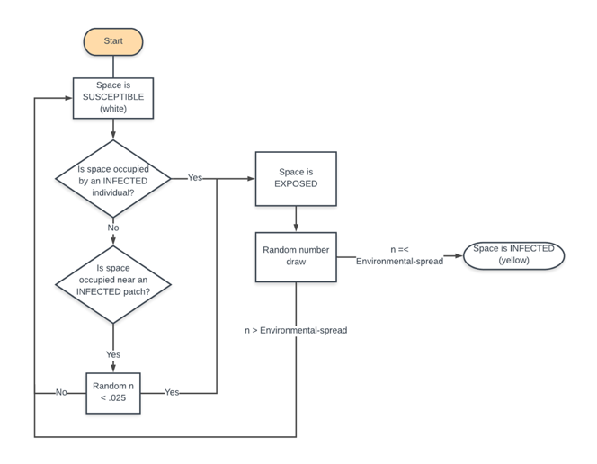
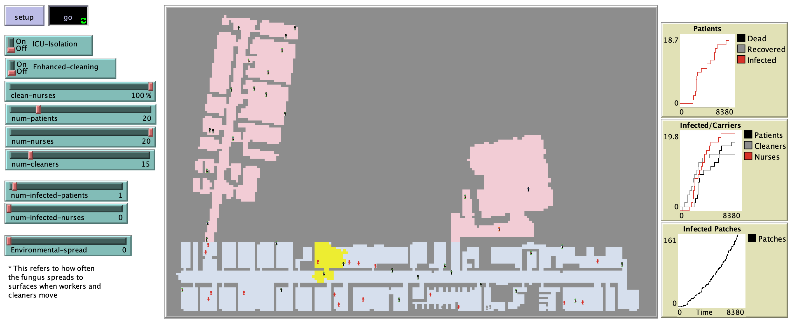

# Drug-Resistant Fungal Infection Model (DR-FIM): An Agent-Based Model of Multidrug Resistant *Candida auris* in an Intensive-Care Unit

## Abstract
"Multi-drug resistant *C. auris* is an emerging threat to hospital ICU-environments worldwide. It is resilient against typical hospital disinfectants, can transfer between people and surfaces, and survive on walls and equipment for long periods of time. An agent-based model depicts the spread of *C. auris* in a hospital under various conditions to explore whether differing nurse-patient ratios and the implementing ICU quarantine policies, utilizing stronger disinfectant, and improving nurse hygiene practices mitigate the spread of infection in patients and the environment. Results indicate that utilizing better disinfectant reduced the average proportion of patients infected in shift-length trials while other conditions caused little to no improvement. Additional investigation is needed to determine the long-term effects of these policies on patient infection."

## &nbsp;
Hospital environment with ICU (blue) and non-ICU (pink) wards:

Agent infection or carrier status criteria:

Space infection criteria:

The NetLogo Graphical User Interface of the Model: 

## &nbsp;

**Version of NetLogo**: NetLogo 6.1.0

**Semester Created**: Fall 2019

