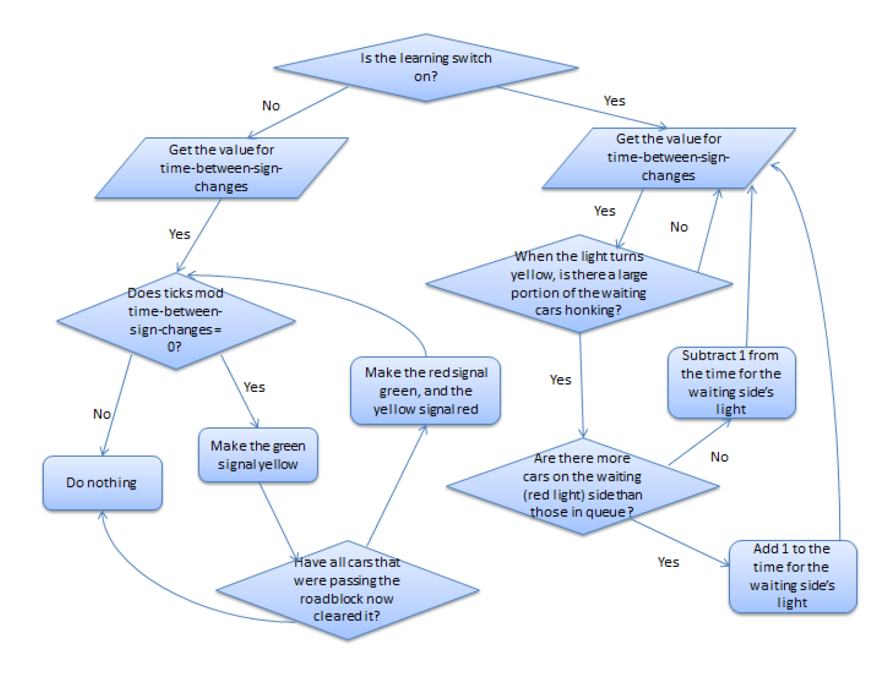
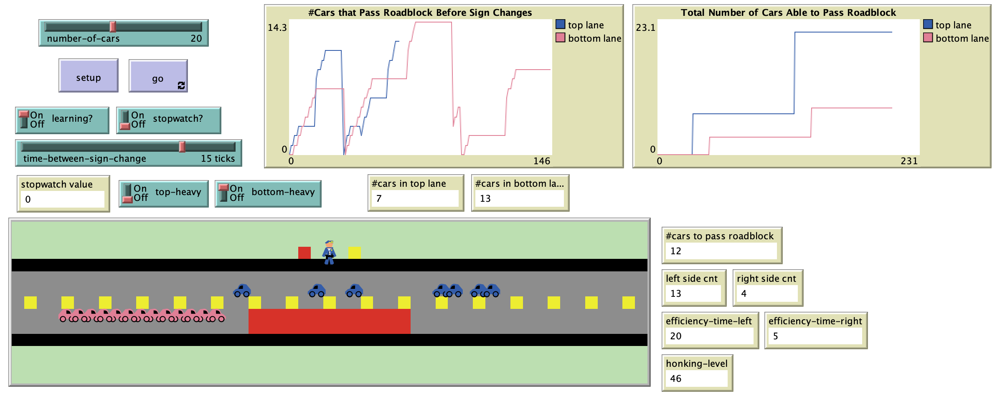

# Oversight in Traffic Model: An Investigation of Traffic Patterns in a Gridlock Situation with Observer Monitoring

## Abstract

"The Oversight in Traffic Model simulates a simple traffic pattern in which two lanes of opposing traffic take turns to pass a roadblock. Movement in the two lanes is governed by a police agent who has the capability to “learn” from the dynamic traffic pattern based on very simple heuristic rules and can modify the signal times when learning is on; otherwise, the signal times are static. The purpose of this study was to analyze the effect of observer oversight on the efficiency of traffic. The results of this study show that the presence of a police agent with the capability to learn from and affect the traffic pattern results in unpredictable traffic patterns: sometimes the traffic was significantly more efficient; other times is was significantly less efficient. In general, however, the average efficiency with the learning function on was less efficient."

## &nbsp;
This figures shows how the police agent changes the signs directing traffic depending on whether the learning switch is on or not:

The NetLogo Graphical User Interface of the Model: 

## &nbsp;

**Version of NetLogo**: NetLogo 6.1.0

**Semester Created**: Fall 2014

