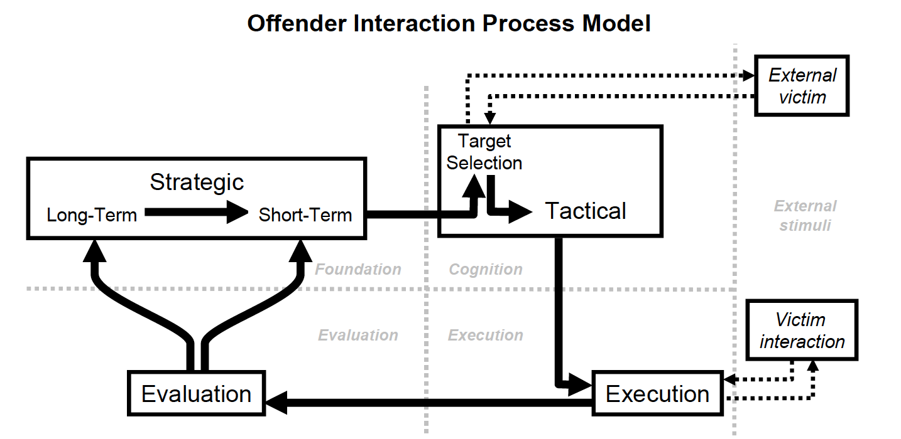
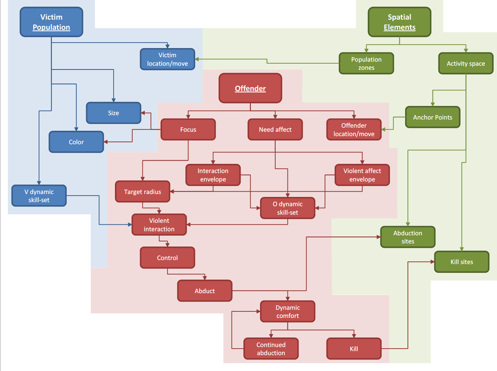
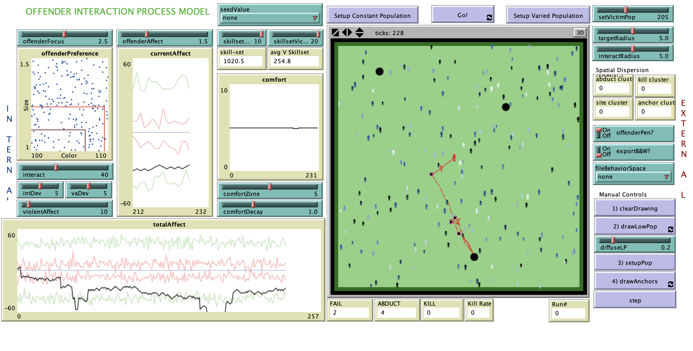

# Offender Interaction NetLogo Model

# Abstract

"The current research involves the construction of a simulation model that describes offender-victim interaction. This model provides both an internal state for the offender and its external manifestation. The model treats the internal cognitive architecture of the offender as a system dynamics model based on the offender’s ongoing reaction to stimuli. The offender’s state at any particular time is compared to internal affect “envelopes”. These internal properties direct the offender’s goal-setting, victim preferences, and spatial interests. The offender’s manifested behaviors are visualized using an agent-based model in a stylized spatial context. Offender behavior simulated includes approach behaviors, spatial comfort and decay, environmental navigation within a learned activity space and other contextual qualities. Ultimately, this model can be used to describe, in part, the dynamic and complex nature of offender-victim interaction."

## &nbsp;
Offender Interaction Process Model:

Implementation of the Model:

The NetLogo Graphical User Interface of the Model: 

## &nbsp;

**Version of NetLogo**: NetLogo 6.1.0

**Semester Created**: Fall 2011

