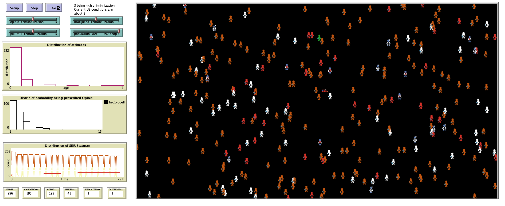

# An Agent Based Model using the SEIR to Analysis Opioid Abuse in The United States

## Abstract
"The abuse of prescription opioids is a very serious problem that has major implications for public health, criminal justice, medicine, and policy. Studies show that prescription drug abuse in the United States is increasing with a high rate specially over the past two decades. This paper uses an agent based modeling to present the impact of some
policy interventions in this complex system."

## &nbsp;
The NetLogo Graphical User Interface of the Model: 

## &nbsp;

**Version of NetLogo**: NetLogo 6.1.0.

**Semester Created**: Fall 2016

