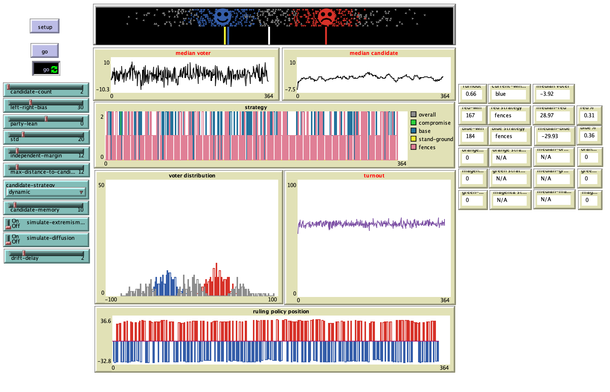

# Participation as Lagging Emergent Behavior in Electoral Systems (PLEBES): An Agent-Based Model of Candidate and Voter Position-Seeking

# Abstract
"This paper will explore the hypothesis that voluntary participation in a given electoral system produces a non-voting population as a result of median-seeking behavior of candidates. As an underlying population shifts from an aggregate centrist distribution toward ideological polarization, this median-seeking behavior is expected to have a negative impact on voter turnout. Utilizing an agent-based model in NetLogo, the sensitivities of polarization, diffusion and preference will be examined as well as the introduction of multiple candidates to test the hypothesis that polarization itself leads to depressed participation as candidates intuitively seek median positions to satisfy a winning proportion of the population. 
It is expected that this behavior is largely deterministic: that provided a limited number of choices, given any meaningful degree of preference, the ideological concentration and dispersion of the population itself will necessarily lead to non-participation, even as candidates actively seek to position themselves in order to satisfy the largest concentration of voters possible within their own acceptable range of motion. While multiple-candidate selections will be presented and may alleviate this symptom, it is expected that outcomes will remain relatively similar. That is, the nature of plurality voting will favor two candidates -- given the single-member district, first-past-the-post regime modeled here." 

## &nbsp;

The NetLogo Graphical User Interface of the Model: 

## &nbsp;

**Version of NetLogo**: NetLogo 6.1.0

**Semester Created**: Fall 2018

