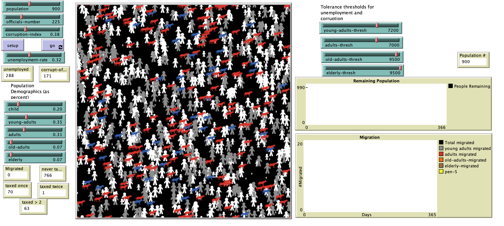

# An Agent-based Approach To Modeling Population Migration: Looking at the Effects of Corruption and Unemployment in Kosovo

## Abstract
"When considering attributes of a failed state, we immediately think of persistent war such as in Syria, systematic and widespread terrorism such as in Somalia (and Somaliland), or functioning failed states, such as much of the states in Africa’s Great Lakes Region and the Middle East.  However, rarely, do international theorists contemplate the gradual (or faster) and potentially permanent migration of large populations from states, leading to eventual state-failure and its impact at the regional level.  Concomitantly, understanding the complex relationships giving rise to the phenomena of state-failure is important in evaluating characteristics for successful secession movements and aid in the future.  This study discusses the large population migrating out of the small and fragile country of Kosovo, due to corruption and unemployment, and the benefits of employing simulation and complexity to understand its ramifications at the state level.  By modeling corruption and unemployment data against the tolerance level of the arguably detached and largest youth population in the Balkans, we can visualize the exodus of the Kosovo population.  This is the first step to modeling the impact of populations permanently leaving Kosovo over a period and its emergence phenomena on the country, region, and target migration countries."

## &nbsp;
The NetLogo Graphical User Interface of the Model: 

## &nbsp;

**Version of NetLogo**: NetLogo 6.1.0

**Semester Created**: Fall 2017

