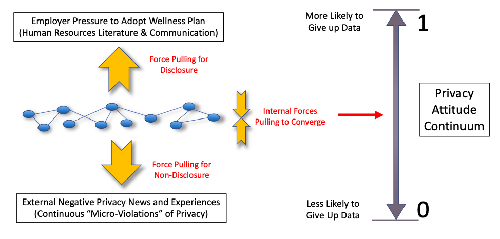
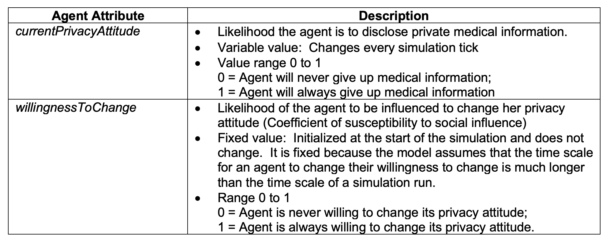
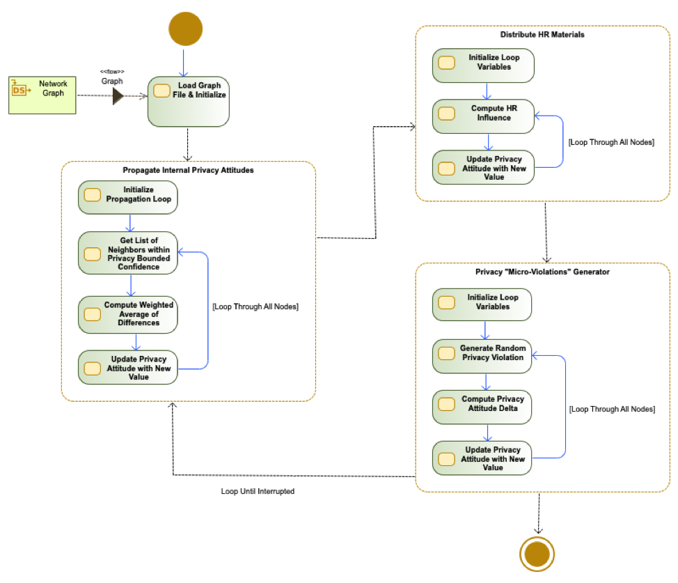
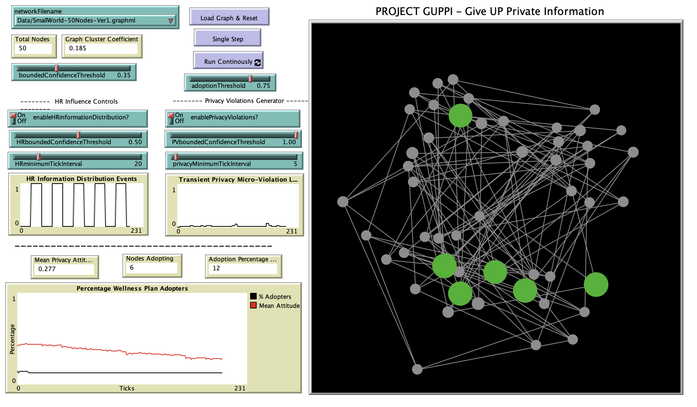

# Privacy Opinion Dynamics of Employee Health and Wellness Program Candidates

## Abstract
"This paper examines the privacy opinion dynamics behavior of a synthetic social network of corporate employees faced with the choice of giving up their private medical information to participate in a corporate health and wellness plan.  An agent-based model (ABM) implementation of the Hegselmann-Krause algorithm was used to characterize the opinion dynamics.  External network influences representing social pressure to adopt the wellness program were modeled along with simulated privacy violations that mimic the background influence of everyday privacy violations.  It was observed that the internal convergence of the opinions among actors in the network occurs very rapidly.  Local regions of opinion convergence behavior are exhibited suggesting that the network develops pockets of local convergence that are driven by the bounded confidence threshold values in the model.  This can occasionally produce a large unexpected re-convergence in the overall wellness plan adoption rate.  The wellness plan adoption rate is shown to be sensitive to the relative boundary confidence threshold (BCT) values for the core network and the HR influence (HR-BCT). "

## &nbsp;
"Conceptual diagram showing social influences on the network and relationship to the group privacy attitude":

"Agent-based model attributes and descriptions":

"UML activity diagram for the simulation architecture":

The NetLogo Graphical User Interface of the Model: 

## &nbsp;

**Version of NetLogo**: NetLogo 6.1.0

**Semester Created**: Fall 2019

