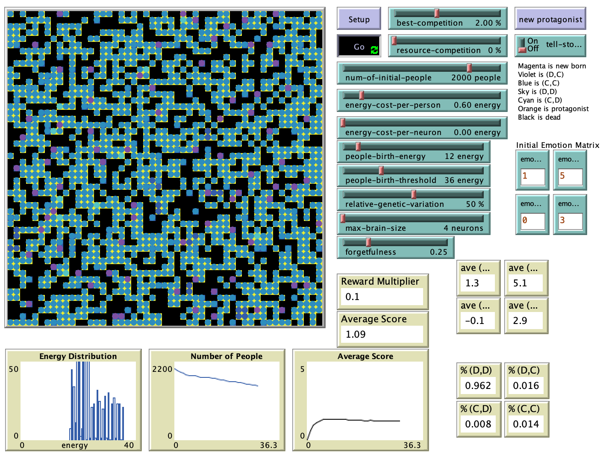

# Emotionally-Rational Cognitive Agents

## Abstract

"This model is an evolutionary iterated spatial prisoner’s dilemma. Agents can evolve emotional responses to events. They memorize something akin to the relative frequency or moving weighted average of their emotional responses to an event, but cannot yet determine temporal patterns or sequences of events."

## &nbsp;
The NetLogo Graphical User Interface of the Model: 

## &nbsp;

**Version of NetLogo**: NetLogo 6.1.0

**Semester Created**: Fall 2011.

