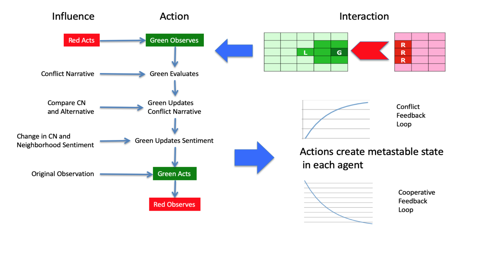
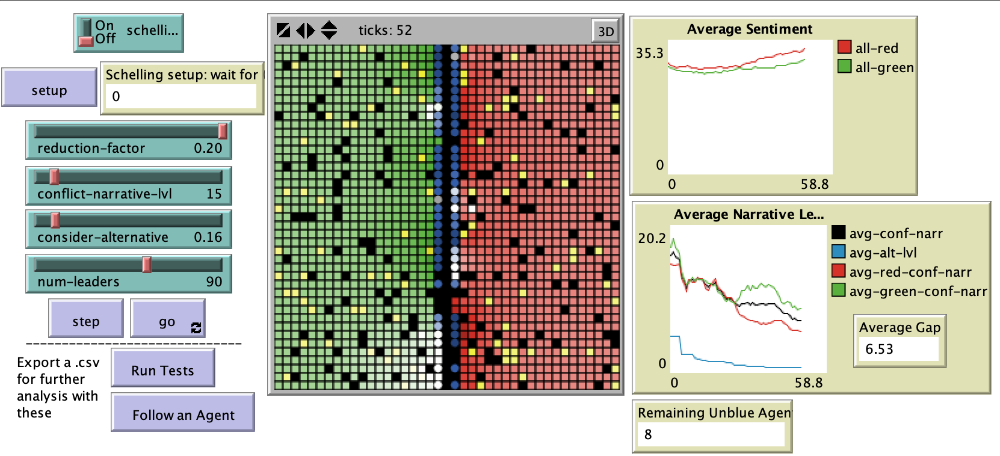

# Reconciliation: Modeling the Role of Conflict Narratives in Protracted Social Conflicts

## Abstract

"This model presents an analysis of how distrustful, physically segregated communities in protracted social conflicts reinforce or break down group narratives through the reporting of individual cross-boundary experiences through social networks. The intent is to determine the sensitivity of opinion change in the population to variations in inter-group experiences, the influence of leaders, the strength of conflict narratives, and the willingness to consider alternative narratives. The broader goal is to test some of the basic theoretical assumptions concerning the psychological processes underlying conflict resolution practice."

## &nbsp;
The effect of a rising conflict narrative. The green diamonds represent the observations falling above and below the threshold. The blue line illustrates the rise and fall of the alternative narrative and its repeated failure to challenge the conflict narrative when it hits the consider-alternative threshold:

The NetLogo Graphical User Interface of the Model: 

## &nbsp;

**Version of NetLogo**: NetLogo 6.1.0

**Semester Created**: Fall 2011

