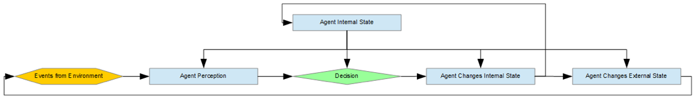
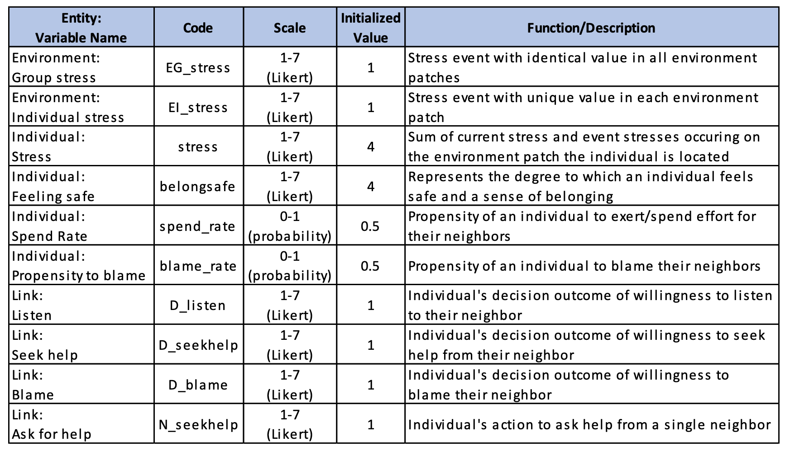
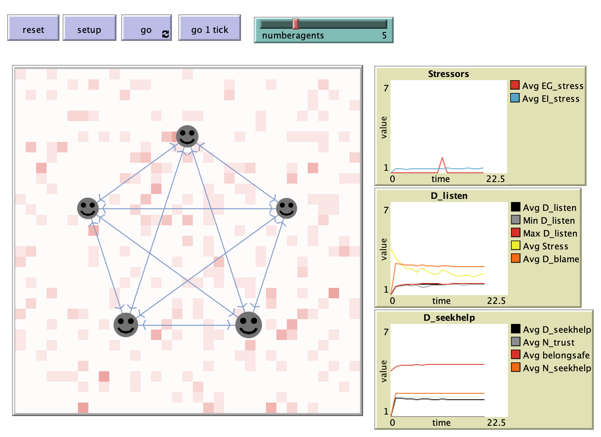

# Building Simulation Models of Resilience of Small Teams

## Abstract
"Resilience research is an area of growing interest, due to the increased stressors facing groups and individuals in a rapidly changing world.  The social, economic, and technology changes have transformed life and generated new stressors.  Individuals, groups and organizations struggle to deal with the change, and resilience is a key capability to help navigate the stress that comes with life and change.  This study presents an agent-based simulation model of resilience of small teams. Unlike other models of team resilience, this model emphasizes the individual attributes and behaviors in generating small team interactions that promote resilience.  The model experimentation studies the formulas used to model individual decisions, interactions, and changes to attributes.  This study also presents a theorical approach to abstracting the factors that build resilience."

## &nbsp;

"Flowchart of high-level model design":

"Key variables used in the simulation model":

The NetLogo Graphical User Interface of the Model: 

## &nbsp;

**Version of NetLogo**: NetLogo 6.1.0.

**Semester Created**: Fall 2019.

